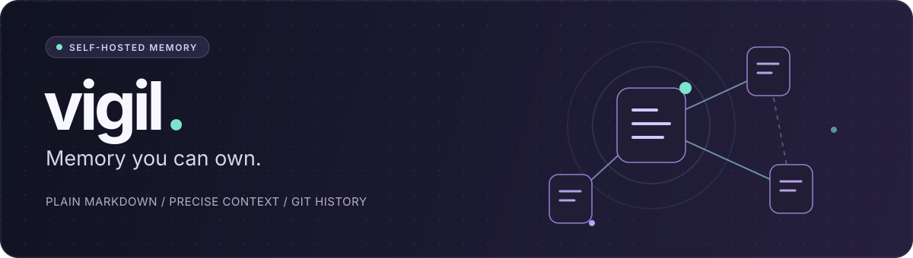

<div align="center">

# vigil



### Your assistant's memory. Your Markdown. Your Git history.

A self-hosted [Model Context Protocol](https://modelcontextprotocol.io) server
that turns a Markdown vault into long-term memory for AI assistants.

[](LICENSE)
[](mix.exs)
[](https://modelcontextprotocol.io/specification/2025-11-25)
[](#how-it-works)

[Quickstart](#quickstart) &nbsp; / &nbsp;
[Documentation](docs/README.md) &nbsp; / &nbsp;
[Contributing](CONTRIBUTING.md) &nbsp; / &nbsp;
[Report a bug](https://github.com/64x-lunicorn/vigil/issues)

</div>

---

## Memory you can actually own

AI memory should not be a black box. With vigil, your notes are ordinary
Markdown files in a Git repository you control. Read them in your editor,
inspect every change, and take them with you.

**Remove vigil tomorrow; your notes and their history stay yours.**

| | What you get |
| :--- | :--- |
| **Portable by default** | Plain Markdown, YAML frontmatter and a Git remote of your choice. No external database service or proprietary storage format. |
| **Context, not clutter** | Heading-level chunks let an assistant retrieve one relevant section instead of an entire note. |
| **History built in** | Every successful edit is committed and pushed. A failed push is reported, not disguised as success. |
| **Connected knowledge** | Wikilinks, Markdown links, backlinks and hub discovery connect related notes. |
| **Guardrails for writes** | Path validation, domain naming rules, explicit confirmation for destructive actions and a rotating SkillKey. |
| **Scoped access** | Built-in OAuth with PKCE, read-only and read/write scopes, and per-token rate limiting. |

> [!NOTE]
> vigil is an early-stage, single-user project. It is not a multi-tenant service,
> a general-purpose sync engine, or a replacement for backups. It assumes one
> writer: vigil. Other vault clients should be read-only.

## How it works

```text
MCP client  -->  vigil  -->  Markdown vault  -->  Git remote
                |
                +-- In-memory index: chunks, search and links
                +-- OAuth: authentication and scoped access
```

The vault is the source of truth. The search index is rebuilt on startup and
on `reload`; OAuth clients and tokens persist separately in local Erlang
DETS files. No external database is needed.

vigil does not run an LLM or generate embeddings. Your MCP client supplies the
assistant; vigil supplies the tools and the memory.

For an internet-facing deployment, put HTTPS and Cloudflare Access in front
of the service. See the [security model](docs/guide.md#security-model).

## Quickstart

### 1. Get the project

Use **Elixir and Erlang/OTP** from [`.tool-versions`](.tool-versions)
(Elixir 1.18.3 / OTP 27.3.4), plus **Git** and **Bash**. The application
declares Elixir `~> 1.17`; the pinned pair is the recommended starting point.

```bash
git clone https://github.com/64x-lunicorn/vigil.git
cd vigil
mix deps.get
```

### 2. Create an isolated demo vault

Writes need a Git remote. This demo uses a **local bare repository**, so you
can try the complete write path without a GitHub account or SSH credentials.
The Git identity below applies only to this throwaway vault.

```bash
DEMO_DIR=$(mktemp -d "${TMPDIR:-/tmp}/vigil-demo.XXXXXX")

git init --bare -b main "$DEMO_DIR/upstream.git"
git init -b main "$DEMO_DIR/vault"
git -C "$DEMO_DIR/vault" config user.name "vigil demo"
git -C "$DEMO_DIR/vault" config user.email "vigil@localhost"
git -C "$DEMO_DIR/vault" config commit.gpgsign false

bash scripts/init_vault.sh "$DEMO_DIR/vault"
git -C "$DEMO_DIR/vault" remote add origin "$DEMO_DIR/upstream.git"
git -C "$DEMO_DIR/vault" push -u origin main
```

This is temporary storage, not a backup. Use a persistent vault and a private
remote for real notes.

### 3. Start vigil

In the same terminal, replace the password placeholder with a unique password
of at least 12 characters:

```bash
export VIGIL_VAULT_PATH="$DEMO_DIR/vault"
export VIGIL_STATE_DIR="$DEMO_DIR/oauth"
export VIGIL_AUTH_PASSWORD='replace-with-your-own-local-password'

mix run --no-halt
```

The MCP endpoint is **`http://localhost:4000/mcp`**. This command does not
restrict the listener to loopback: use a trusted development machine with a
firewall, and do not expose port 4000 to the internet.

In another terminal, verify OAuth discovery:

```bash
curl --fail http://localhost:4000/.well-known/oauth-protected-resource
```

### 4. Connect your assistant

Add `http://localhost:4000/mcp` as a remote HTTP MCP server in a client that
supports OAuth with PKCE. Complete the consent screen using the password above.
Choose `vault:read` for read-only access or `vault` for read/write access.
A cloud-hosted client cannot reach your machine's `localhost`; use the
[server deployment guide](docs/guide.md#deploy-on-a-server) instead.

Try asking your assistant:

> "Search my vault for vigil, then read the matching note."

Before using writes with real notes, install and read the
[vault conventions skill](scripts/templates/vigil-vault-conventions.md).
Server initialization installs it automatically; the local demo does not.
Write tools require a current SkillKey from `skill_read`.

Need a token for a client without interactive OAuth? See the
[token-seeding task](lib/mix/tasks/vigil.seed_token.ex) and
[OAuth reference](docs/oauth.md).

## What your assistant can do

| Workflow | Tools |
| :--- | :--- |
| **Find and explore** | `search`, `read`, `links` |
| **Capture and maintain** | `create`, `append`, `replace_section`, `rewrite_note`, `update_frontmatter` |
| **Organize and remove** | `move_note`, `delete_section`, `delete_note` |
| **Stay current** | `current`, `lint`, `reload` |
| **Follow your conventions** | `skill_list`, `skill_read`, `skill_write` |

See the [full tool reference](docs/guide.md#tools) for parameters, scopes and
confirmation requirements.

## Deploy and operate

The repository includes a **Debian 13 + systemd** deployment path:

- **Set up:** install the runtime and service with
  [`setup.sh`](scripts/setup.sh), then provision a vault and start vigil with
  [`init.sh`](scripts/init.sh).
- **Configure:** use [`vigil.env.example`](deploy/vigil.env.example) for vault
  location, public OAuth URLs, timezone, language and access settings.
- **Update:** [`update.sh`](scripts/update.sh) builds a release, checks it and
  rolls back automatically if acceptance fails.
- **Inspect:** `sudo ./scripts/init.sh --check-only` checks an existing vault
  without modifying it.

Start with the [deployment guide](docs/guide.md#deploy-on-a-server), then read
[configuration](docs/guide.md#configuration),
[operations](docs/guide.md#operations) and
[troubleshooting](docs/guide.md#troubleshooting).

## Documentation

| Guide | Start here when you want to... |
| :--- | :--- |
| [User guide](docs/guide.md) | Understand vault structure, tools, safe writes and day-to-day operations. |
| [Design](docs/design.md) | Explore the architecture, trade-offs and deliberate non-goals. |
| [OAuth](docs/oauth.md) | Integrate a client or inspect the authentication flow. |
| [Project history](docs/history.md) | Follow implementation decisions and lessons learned. |
| [Contributing](CONTRIBUTING.md) | Set up development, run checks and submit a focused change. |
| [Security policy](SECURITY.md) | Report a vulnerability privately or review deployment precautions. |

## Contributing

Bug reports, documentation improvements and focused pull requests are welcome.
For larger changes, open an [issue](https://github.com/64x-lunicorn/vigil/issues)
first to discuss the approach.

```bash
mix deps.get
mix test
```

See [CONTRIBUTING.md](CONTRIBUTING.md) for formatting, targeted tests and the
separate shell-script checks. Please use synthetic vault data in reports and
tests, never personal notes or credentials.

## License and credits

vigil is licensed under the **[MIT License](LICENSE)**.
The existing copyright notice is **Copyright (c) 2026 Lunicorn-lab**.

Third-party components keep their own licenses. See
[THIRD_PARTY_NOTICES.md](THIRD_PARTY_NOTICES.md) for the locked dependency
inventory and attribution for the development skills from
[Matt Pocock's skills collection](https://github.com/mattpocock/skills).

Your vault is separate from this project's source code. Using vigil does not
require you to publish your notes or license them under MIT.
