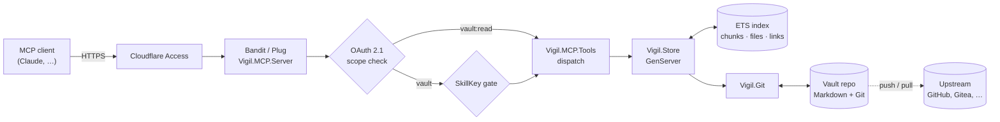
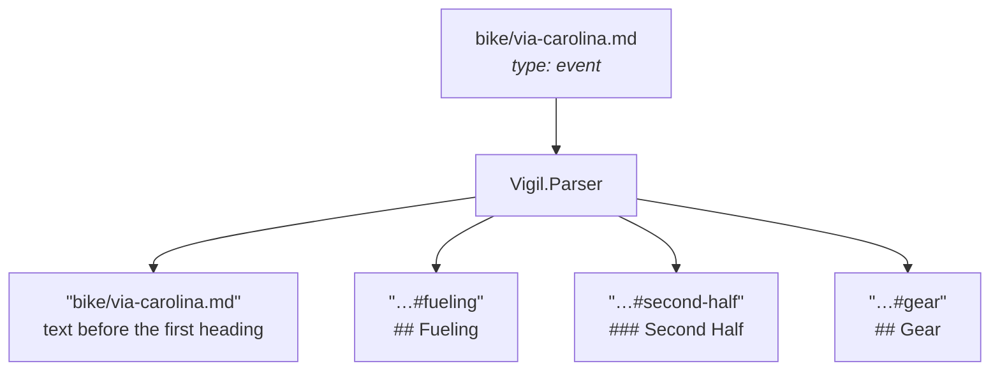
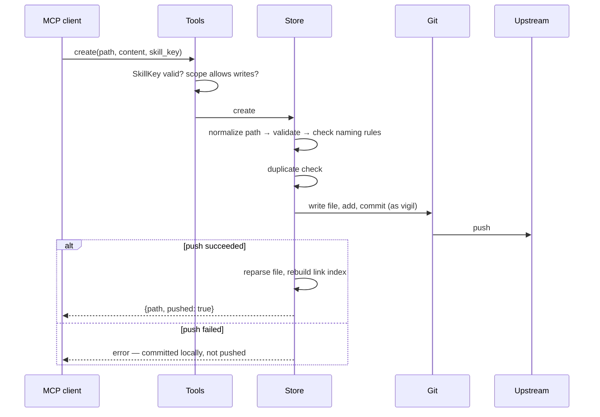
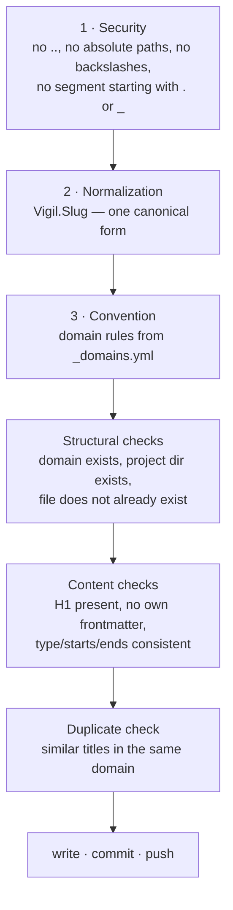
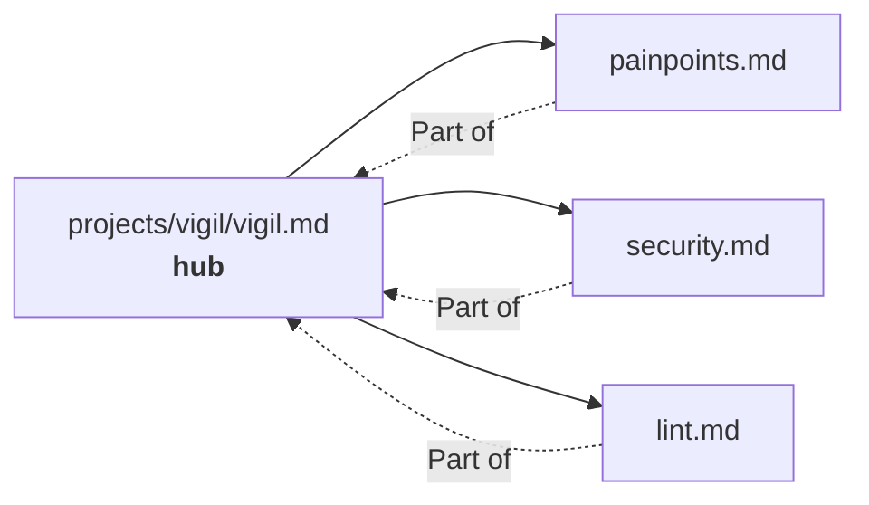
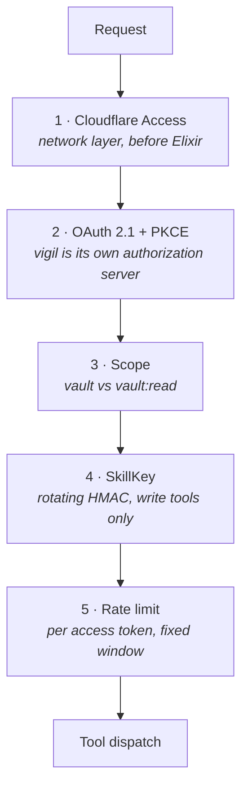

# vigil

**A self-hosted MCP server that turns a folder of Markdown files into long-term memory for an AI assistant.**

Your notes stay plain Markdown in a Git repository you own. vigil indexes them
in memory, serves them over the [Model Context Protocol](https://modelcontextprotocol.io),
and writes changes back as ordinary Git commits — one commit per edit, pushed
immediately.

No database. No vendor lock-in. If you delete vigil tomorrow, you still have a
folder of Markdown files and their full history.

[](LICENSE)


---

## Table of contents

- [Why this exists](#why-this-exists)
- [How it works](#how-it-works)
- [The vault](#the-vault)
- [Quickstart](#quickstart)
- [Tools](#tools)
- [Writing safely](#writing-safely)
- [Links between notes](#links-between-notes)
- [Security model](#security-model)
- [Configuration](#configuration)
- [Operations](#operations)
- [Adopting an existing vault](#adopting-an-existing-vault)
- [Troubleshooting](#troubleshooting)
- [Development](#development)
- [Design decisions](#design-decisions)
- [Further reading](#further-reading)
- [License](#license)

---

## Why this exists

Assistant memory is usually a black box: you cannot read it, diff it, grep it,
or take it with you. vigil takes the opposite position — **the files are the
truth**:

- **Plain Markdown.** Readable in any editor, Obsidian included.
- **Git is the storage layer.** Every write is a commit with a real message.
  History, blame and rollback come for free.
- **The index is disposable.** It lives in memory and is rebuilt from the files
  at every start. Losing it costs a restart, not data.
- **Chunk-level retrieval.** Notes are split at headings, so the assistant
  fetches one section — not a 3000-word file — into its context.

---

## How it works



The ETS index only exists in process memory and is rebuilt from the Git working
tree at every start and on every `reload`. The single source of truth is the
vault repository; restarting `Vigil.Store` never loses data, only a warm index.

### A note becomes chunks

A note is split at its headings. Each chunk is independently addressable and
independently retrievable — that is what keeps the assistant's context small.



`search` returns those chunk ids; `read` fetches exactly one of them.

### What happens on a write

Every write is validated, committed and pushed before the client is told it
succeeded. If the push fails, the client is told — the change is not silently
stranded on the server.



---

## The vault

A vault is a Git repository with one directory per **domain**:

```
vault/
├── _domains.yml          # the domains and their rules
├── admin/
├── gear/
├── home/
├── journal/
│   └── 2026-07-09.md
├── projects/             # one subdirectory per project
│   └── vigil/
│       ├── vigil.md      # hub note
│       └── painpoints.md # spoke
├── training/
└── skills/               # instructions for the assistant, never indexed
```

Domains are read from the filesystem at runtime — adding one means creating a
directory and an entry in `_domains.yml`, then calling `reload`. No code change.

### Frontmatter

Three fields, nothing else:

```yaml
---
type: reference      # reference | decision | event
starts: 2026-07-10T17:00:00+02:00   # only for type: event
ends:   2026-07-12T20:00:00+02:00   # only for type: event
---
```

| type | meaning | ages? |
|---|---|---|
| `reference` | a fact about the world | no |
| `decision` | a fact about the vault owner, a choice they made | yes — `lint` flags stale ones |
| `event` | has a start and an end; surfaces in `current` | it passes |

### `_domains.yml`

A domain is either a plain description, or a map that adds naming rules:

```yaml
gear:      "Equipment: bikes, components, maintenance"
projects:  "Software projects. One subdirectory per project"

journal:
  description: "Chronological, hidden from the default search"
  naming:
    pattern: '^\d{4}-\d{2}-\d{2}\.md$'   # filenames must match this
    scope: filename                       # or: relpath
    suggestion: date                      # or: slug — shapes the error message
    hint: "Journal notes are named YYYY-MM-DD.md"
```

Violating a naming rule returns an error containing the rule *and* a concrete
suggested path. A broken regex in the config is logged and ignored — a bad
config never blocks writing.

---

## Quickstart

### Try it locally

```bash
mix deps.get
./scripts/init_vault.sh /tmp/my-vault

VIGIL_VAULT_PATH=/tmp/my-vault \
VIGIL_AUTH_PASSWORD=a-long-local-test-password \
VIGIL_STATE_DIR=/tmp/my-vault-oauth \
mix run --no-halt
```

The server listens on `http://localhost:4000/mcp`.

### Deploy on a server

Two scripts, in order. Both are idempotent and safe to re-run.

```bash
sudo ./scripts/setup.sh                     # Debian 13 → installed, not started
sudo ./scripts/init.sh --new-vault          # vault, secrets, build, start, verify
```

or, to adopt a vault you already have:

```bash
sudo ./scripts/init.sh --existing-vault git@github.com:you/vault.git
```

`setup.sh` installs packages, creates the `vigil` system user, sets up its SSH
identity (verifying GitHub's host key fingerprint), clones the code and
installs the systemd unit. `init.sh` provisions the vault, generates secrets,
audits dependencies, runs the test suite, builds a release, starts the service,
seeds two OAuth tokens, and finishes with an acceptance check.

`init.sh` prints both tokens **once** at the end. After that they exist only in
`/var/lib/vigil/oauth_tokens.dets`, readable by root.

---

## Tools

Seventeen tools. "RW" means the token needs the `vault` scope; a `vault:read`
token gets an explicit error. "Key" means the call must carry a current
`skill_key`.

| Tool | Parameters | Returns | Role | Key |
|---|---|---|---|:--:|
| `search` | query, domain?, type?, prefer?, limit? | ranked hits with previews, plus `hub` when unambiguous | RO/RW | – |
| `read` | id, backlinks? | one chunk, or a note's table of contents plus `links` counters | RO/RW | – |
| `links` | id, direction?, depth? | resolved outgoing/incoming references | RO/RW | – |
| `create` | path, type, content, starts?, ends?, force?, create_dirs? | `{path, pushed, path_normalized_from?}` | RW | ✓ |
| `append` | path, heading?, content | `{path, pushed}` | RW | ✓ |
| `replace_section` | id, content | `{path, pushed}` | RW | ✓ |
| `rewrite_note` | path, content, confirm? | `{path, pushed}` | RW | ✓ |
| `delete_section` | id | `{path, pushed}` | RW | ✓ |
| `update_frontmatter` | path, type, starts?, ends? | `{path, pushed}` | RW | ✓ |
| `delete_note` | path, confirm | `{path, deleted, pushed}` | RW | ✓ |
| `move_note` | from, to, confirm | `{from, to, pushed, broken_backlinks}` | RW | ✓ |
| `lint` | – | duplicate/sentence headings, broken links, overlong notes, stale decisions | RO/RW | – |
| `current` | – | current time plus active and nearby events | RO/RW | – |
| `reload` | – | `{reloaded, pull_failed?}` | RW | – |
| `skill_list` | – | skills with their descriptions | RO/RW | – |
| `skill_read` | name | skill content, prefixed with the current SkillKey | RO/RW | – |
| `skill_write` | name, content | `{name, pushed}` | RW | ✓ |

### Paths are normalized, not rejected

`create` and `move_note` canonicalize the path before anything else: lowercase,
transliterated diacritics (`ü`→`ue`, `ø`→`oe`), non-alphanumeric runs collapsed
to a single hyphen, truncated at 80 characters on a hyphen boundary.

```
"projects//Vigil/Pain Points.md"  →  "projects/vigil/pain-points.md"
"bike/Café Übersicht!!.md"        →  "bike/cafe-uebersicht.md"
```

When the path changed, the response contains `path_normalized_from`. **Use the
returned `path`** — that is where the note actually lives.

The same slug function produces chunk ids, so file names and `[[…]]` references
can never drift apart. Before changing that function, `mix vigil.slug_diff
<vault>` shows exactly which chunk ids would move.

---

## Writing safely

Three layers guard every write, in this order:



Beyond that:

- **Destructive operations need `confirm: true`.** `delete_note` and
  `move_note` always; `rewrite_note` only past a shrink threshold (removing
  more than half the sections, or more than 20 headings). The error says which
  threshold tripped and how many sections would go.
- **`delete_note` previews the damage.** Without `confirm`, the error lists the
  notes that currently link to the target.
- **A failed write never takes the server down.** Permission errors, a full
  disk, a read-only filesystem — all become plain error messages while `read`
  and `search` keep answering.
- **The SkillKey.** Every write tool requires a rotating HMAC token that the
  assistant can only get by calling `skill_read` on the conventions skill. The
  point is not access control (the OAuth token already did that) — it is that
  the assistant has demonstrably *read the writing rules* in this session.

---

## Links between notes

vigil indexes `[[wikilinks]]` and `[markdown](links.md)` and resolves them
against the actual vault:

| form | example |
|---|---|
| wikilink | `[[painpoints]]` |
| with a chunk | `[[painpoints#deploy-error]]` |
| with an alias | `[[painpoints\|known issues]]` |
| markdown link | `[known issues](painpoints.md)` |

Links inside fenced code blocks and inline code are **not** indexed — otherwise
example code would register as real references.

**Resolution.** A target containing `/` is treated as a vault-relative path.
Otherwise the basename is looked up in the same folder first, then the same
domain, then vault-wide. More than one match at a stage means `ambiguous`, with
all candidates listed. No match means `broken` — which is not an error: a link
to a note that does not exist yet is a legitimate placeholder.

**Hub and spoke.** When a note has exactly one incoming link, `search` attaches
that note as `hub`. A hit in a spoke therefore brings its entry point along, at
no extra round trip. With several incoming links the field is omitted rather
than guessed.



---

## Security model



1. **Cloudflare Access** sits in front of the service. `init.sh` aborts if the
   public endpoint answers with anything other than 403 — that is, unless
   Access is actually in place.
2. **OAuth 2.1** with Authorization Code + PKCE. Dynamic Client Registration
   and Client-ID Metadata Documents are both supported. No static bearer token.
3. **Scopes.** `vault` for full access, `vault:read` for read-only clients.
4. **SkillKey.** Rotating HMAC derived from `VIGIL_AUTH_PASSWORD`, required by
   every write tool.
5. **Rate limiting** per access token, fixed window.

The systemd unit runs with `ProtectSystem=strict`, `ProtectHome=true`,
`PrivateTmp=true`, `NoNewPrivileges=true`, and `/var/lib/vigil` as the only
writable path.

---

## Configuration

All settings come from environment variables in `/etc/vigil/env`
(see [`deploy/vigil.env.example`](deploy/vigil.env.example)).

| Variable | Default | Purpose |
|---|---|---|
| `VIGIL_VAULT_PATH` | `test/fixtures/vault` | path to the vault's Git clone |
| `VIGIL_PORT` | `4000` | HTTP port |
| `VIGIL_GIT_REMOTE` | `origin` | remote used for pull **and** push; must match `git branch -vv` |
| `VIGIL_TZ` | `Europe/Berlin` | timezone for `current`, envelopes, relative times |
| `VIGIL_EXCLUDE` | empty | comma-separated directory names that are never parsed |
| `VIGIL_ISSUER` | `http://localhost:4000` | OAuth issuer |
| `VIGIL_RESOURCE` | `http://localhost:4000/mcp` | canonical MCP endpoint URI (audience) |
| `VIGIL_AUTH_PASSWORD` | — | consent password, **required, min. 12 characters**; also the SkillKey HMAC secret |
| `VIGIL_STATE_DIR` | `tmp/oauth_state` | directory for the three `:dets` files |
| `VIGIL_SKILLKEY_TTL` | `3600` | SkillKey rotation window in seconds |
| `VIGIL_RATE_LIMIT_RPM` | `60` | max `tools/call` per minute per access token |
| `VIGIL_VAULT_OWNER` | `the vault owner` | who the notes belong to — shapes the writing instructions |
| `VIGIL_VAULT_LANGUAGE` | `English` | language the **notes** are written in; vigil's own output is always English |

The last two only affect the instructions handed to the MCP client on connect.
If your vault is in German, set `VIGIL_VAULT_LANGUAGE=German` and the assistant
will keep writing German notes.

---

## Operations

```bash
sudo ./scripts/update.sh                 # move to origin/main
sudo ./scripts/update.sh --to v1.2.3     # to a specific tag or commit
sudo ./scripts/update.sh --rollback      # back to the previous release
```

`update.sh` builds the new code as its own release and switches by symlink
(`stop` → symlink → `start`, never `restart`), then runs the acceptance check.
If that fails it **rolls back automatically**, restarts, and checks again —
exiting 3 with `Update rolled back to <old-sha>. The service is running again.`

- **Logs:** `journalctl -u vigil -f`
- **Vault state:** `git -C /var/lib/vigil/vault log --oneline -5`
- **Health check:** `sudo ./scripts/init.sh --check-only` — safe against a
  running service
- **Add a domain:** create the directory, add it to `_domains.yml`, call
  `reload`. No code change, no restart.

---

## Adopting an existing vault

A vault that predates vigil rarely satisfies its assumptions: no `.obsidian/`
in `.gitignore`, missing `_domains.yml` entries, notes without frontmatter,
non-canonical filenames. `init.sh --existing-vault` therefore runs an adoption
phase that separates two kinds of finding:

**Applied automatically** (additive, committed as one `vault adoption` commit):
`.gitignore` entry for `.obsidian/` including untracking it, local git identity
and `commit.gpgsign false`, upstream `main` → `github/main`, missing
`_domains.yml` entries (without naming rules — those are a human decision),
directory permissions.

**Reported only** (never repaired automatically, never blocking): frontmatter
problems, non-canonical filenames with a suggested `move_note`, the chunk-id
migration risk, domains that exist only in the config, unpushed commits, notes
past the consolidation threshold, an extra remote with unclear purpose.

The same check runs standalone and strictly read-only:

```bash
sudo ./scripts/init.sh --check-only                 # /var/lib/vigil/vault
sudo ./scripts/init.sh --check-only --vault /path   # somewhere else
```

Exit 0 (no findings) / 2 (vault unreadable) / 3 (findings present), so it is
usable from cron or CI. Worth running before every `update.sh`, and after
editing the vault in another tool.

---

## Troubleshooting

| Symptom | Cause | Fix |
|---|---|---|
| Every tool answers `EXIT time out`, even `read` | `Vigil.Store` died, usually after a write error | `systemctl restart vigil`, then check `journalctl -u vigil`; for permission errors `chown -R vigil:vigil /var/lib/vigil` |
| Service will not start, journal shows an OAuth store error | `Vigil.OAuth.Store` could not open the `dets` files | check ownership and permissions of `VIGIL_STATE_DIR`. A broken OAuth store deliberately takes the whole service down — a service that cannot authenticate anyone is worse than no service |
| `git pull failed: Host key verification failed` | the service user's `known_hosts` is empty | re-run `setup.sh` (idempotent) |
| `Permission denied (publickey)` | deploy key not registered, or registered without write access | add the key from `/var/lib/vigil/.ssh/id_ed25519.pub`, enable "Allow write access" |
| Writes fail with "Missing or expired SkillKey" | key not passed, or older than two rotation windows | call `skill_read` on `vigil-vault-conventions` and use the key it returns — the error case returns one too |
| `create` fails with "does not match the schema for domain" | the domain has a `naming.pattern` the path does not satisfy | the error contains a valid suggestion; or adjust `naming` in `_domains.yml` |
| Chunk ids change unexpectedly after a deploy | the slug logic changed without checking the migration diff | run `mix vigil.slug_diff <vault>` *before* deploying |
| Client gets 401 | token wrong, expired, or wrong scope for the tool | seed a new token (`mix vigil.seed_token`) or redo the OAuth flow |
| Client gets 403 from the endpoint, not from Elixir | Cloudflare Access service token missing in the client | fix the Access configuration — never disable Access to "solve" this |
| Changes do not appear on other devices | push failed, commit is local | `git -C /var/lib/vigil/vault rev-list --count github/main..main`, then push |

---

## Development

```bash
mix deps.get
mix test
```

`mix test` runs **without** `MIX_ENV=prod`. In `prod`, Mix loads the production
config and would reach for `/var/lib/vigil`; `config/runtime.exs` pins fixed,
safe paths for `MIX_ENV=test` regardless of what is in the environment, so a
stray `VIGIL_VAULT_PATH` cannot make a green test run meaningless.

`scripts/*.sh` are covered separately — outside `mix test` — by
`bash scripts/test/check_only_test.sh`, which exercises `init.sh --check-only`
against a throwaway fixture vault without needing root or a real
`/opt/vigil/repo` install (see the `VIGIL_INIT_TEST_STUBS` seam in `init.sh`).

```
lib/vigil/
├── application.ex       # supervisor
├── store.ex             # GenServer — ETS index, search, writes, links, lint
├── parser.ex            # file → frontmatter + chunks + raw links
├── slug.ex              # the single canonical slug implementation
├── search.ex            # pure ranking functions
├── git.ex               # System.cmd wrapper: add/commit/push/pull/log/rm/mv
├── skill_key.ex         # rotating HMAC attestation token
├── vault_discovery.ex   # pure file discovery, no GenServer
├── vault_check.ex       # read-only vault doctor
├── oauth/               # authorization server: dets store, DCR, CIMD, PKCE
└── mcp/
    ├── server.ex        # Bandit + Plug: JSON-RPC and OAuth endpoints
    ├── tools.ex         # tool definitions, dispatch, SkillKey gate
    ├── rate_limit.ex    # fixed-window rate limit per token
    └── envelope.ex      # time envelope, session delta tracking

lib/mix/tasks/
├── vigil.seed_token.ex  # seed a long-lived OAuth access token
├── vigil.slug_diff.ex   # migration diff for slug logic changes
└── vigil.vault_check.ex # JSON report used by init.sh
```

All reads go through the `Vigil.Store` GenServer because the ETS tables are
private to it. For a single-user knowledge base that serialization is a
feature, not a bottleneck: it makes every write atomic with respect to reads.

---

## Design decisions

Things that look odd until you know why.

**The link index is rebuilt in full on every write.** Not incrementally
maintained. This structurally rules out ghost entries after a delete or rename
instead of requiring every write path to get the bookkeeping right. The
candidate index for basename resolution is built once per rebuild rather than
once per link — without that the rebuild would be O(links × files) and would
dominate the write path. Measured on a synthetic vault of 1000 notes and 2000
links: full load 0.34 s, one write including a complete index rebuild ~115 ms.

**Git identity and signing are forced per commit.** `Vigil.Git` passes
`-c user.name`, `-c user.email` and `-c commit.gpgsign=false` on every commit
rather than trusting ambient git configuration. The service user has no signing
key; an inherited `commit.gpgsign=true` would otherwise fail every single write.

**A broken `_domains.yml` never blocks writing.** An invalid naming regex is
logged and ignored. Configuration mistakes should not lock you out of your own
notes.

**`skill_read` returns the SkillKey even when the skill is missing.** The key is
a pure HMAC over secret and time, independent of any skill existing. Without
this, bootstrapping deadlocks: `skill_write` needs a key, and on a fresh vault
there is no conventions skill to read one from.

**`search` hides `journal/` unless asked.** A chronological log otherwise
dominates every result set.

**The write path is crash-safe by construction.** File system errors are
converted to error tuples, never allowed to propagate and take the GenServer
with them. A single failed write must not cost you read access to everything
else.

---

## Further reading

| Document | What it covers |
|---|---|
| [docs/design.md](docs/design.md) | Principles, the vault model, chunking, search, the link index, the write path, non-goals and known trade-offs |
| [docs/oauth.md](docs/oauth.md) | The OAuth 2.1 implementation in detail |
| [docs/history.md](docs/history.md) | What was built in each round, and the bugs found along the way |

---

## License

MIT — see [LICENSE](LICENSE).
