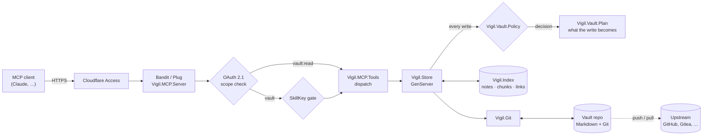
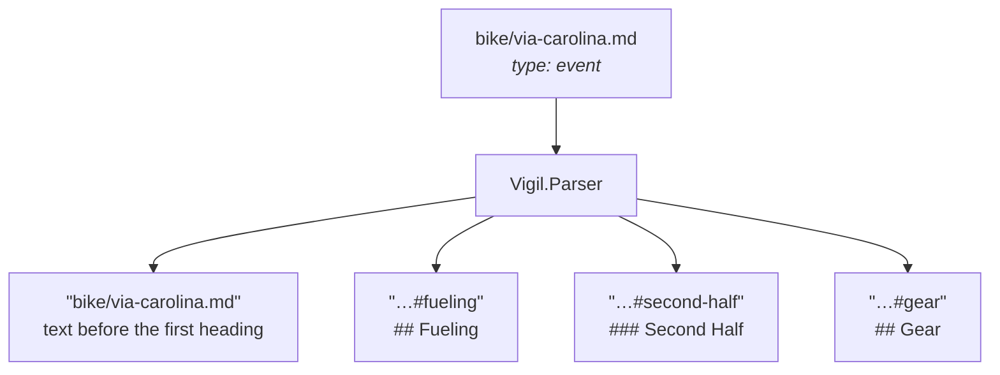
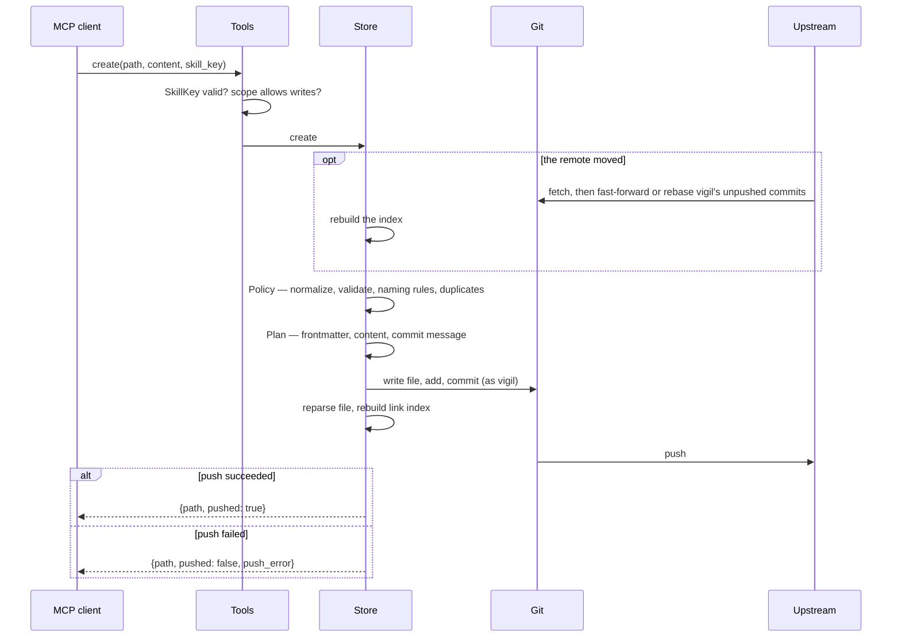
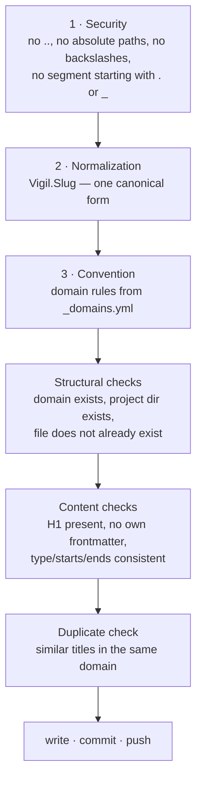
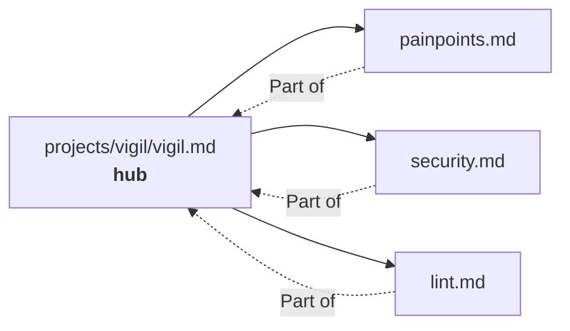
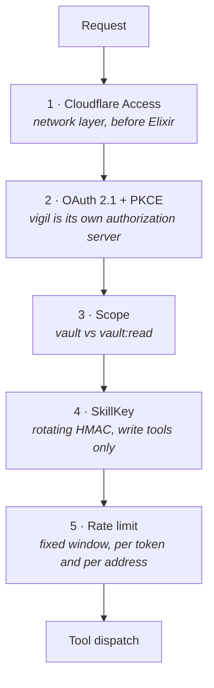

# User guide

[Back to vigil](../README.md) · [Documentation index](README.md)

**A self-hosted MCP server that turns a folder of Markdown files into long-term memory for an AI assistant.**

Your notes stay plain Markdown in a Git repository you own. vigil indexes them
in memory, serves them over the [Model Context Protocol](https://modelcontextprotocol.io),
and writes changes back as ordinary Git commits — one commit per edit, pushed
immediately.

No database. No vendor lock-in. If you delete vigil tomorrow, you still have a
folder of Markdown files and their full history.

[](../LICENSE)


---

## Table of contents

- [Why this exists](#why-this-exists)
- [How it works](#how-it-works)
- [The vault](#the-vault)
- [Quickstart](#quickstart)
- [Connecting clients](clients.md) — its own document
- [Tools](#tools)
- [Writing safely](#writing-safely)
- [Links between notes](#links-between-notes)
- [Security model](#security-model)
- [Configuration](#configuration)
- [Supported platforms](#supported-platforms)
- [Operations](#operations)
- [Revoking access](#revoking-access)
- [Rotating secrets](#rotating-secrets)
- [Editing by hand](#editing-by-hand)
- [Adopting an existing vault](#adopting-an-existing-vault)
- [Troubleshooting](#troubleshooting)
- [Development](#development)
- [Design decisions](#design-decisions)
- [Further reading](#further-reading)
- [License](#license)

---

## Why this exists

Assistant memory is usually a black box: you cannot read it, diff it, grep it,
or take it with you. vigil takes the opposite position — **the files are the
truth**:

- **Plain Markdown.** Readable in any editor, Obsidian included.
- **Git is the storage layer.** Every write is a commit with a real message.
  History, blame and rollback come for free.
- **The index is disposable.** It lives in memory and is rebuilt from the files
  at every start. Losing it costs a restart, not data.
- **Chunk-level retrieval.** Notes are split at headings, so the assistant
  fetches one section — not a 3000-word file — into its context.

---

## How it works



The index only exists in process memory — a plain value held in
`Vigil.Store`'s state — and is rebuilt from the Git working tree at every
start and on every `reload`. The single source of truth is the vault
repository; restarting `Vigil.Store` never loses data, only a warm index.

Clients connect to `/mcp` over the Streamable HTTP transport. vigil speaks the
MCP protocol versions **2025-11-25**, **2025-06-18** and **2025-03-26**, answers
`initialize` with the client's version when it is one of these and with
2025-11-25 otherwise, and holds every later request in the session to the
version it negotiated. See [Protocol versions](design.md#protocol-versions).

### A note becomes chunks

A note is split at its headings. Each chunk is independently addressable and
independently retrievable — that is what keeps the assistant's context small.



`search` returns those chunk ids; `read` fetches exactly one of them.

### What happens on a write

Every write is validated, committed and pushed before the client gets an
answer. Before it, the server fetches from the remote and brings the vault on
top of whatever was pushed there in the meantime — a fast-forward, or a rebase
of its own unpushed commits — so a human's push does not make the next write's
push fail. A push refused because someone pushed in between is rebased and
tried again, up to three times. A rebase that conflicts is aborted: the commit
stays local and `push_error` names the path a human has to resolve. If only the push fails, the write still succeeded: the answer says
`pushed: false` and carries the reason in `push_error`, so the client knows
without being invited to retry — a retried `append` would append twice, unless
it carries the same `request_id` as the first call. The commit goes out with
the next successful push, or within 15 minutes through the
[push safety net](#the-push-safety-net). A write whose *commit* fails is an error, and the vault is
left as it was: a deleted note is back, a moved note is at its old path, and
nothing is left staged for the next commit to pick up.



---

## The vault

A vault is a Git repository with one directory per **domain**:

```
vault/
├── _domains.yml          # the domains and their rules
├── admin/
├── gear/
├── home/
├── journal/
│   └── 2026-07-09.md
├── projects/             # one subdirectory per project
│   └── vigil/
│       ├── vigil.md      # hub note
│       └── painpoints.md # spoke
├── training/
└── skills/               # instructions for the assistant, never indexed
```

Domains are read from the filesystem at runtime — adding one means creating a
directory and an entry in `_domains.yml`, then calling `reload`. No code change.

### Frontmatter

Three fields, nothing else:

```yaml
---
type: reference      # reference | decision | event
starts: 2026-07-10T17:00:00+02:00   # only for type: event
ends:   2026-07-12T20:00:00+02:00   # only for type: event
---
```

| type | meaning | ages? |
|---|---|---|
| `reference` | a fact about the world | no |
| `decision` | a fact about the vault owner, a choice they made | yes — `lint` flags stale ones |
| `event` | has a start and an end; surfaces in `current` | it passes |

### `_domains.yml`

A domain is either a plain description, or a map that adds naming rules:

```yaml
gear:      "Equipment: bikes, components, maintenance"
projects:  "Software projects. One subdirectory per project"

journal:
  description: "Chronological, hidden from the default search"
  naming:
    pattern: '^\d{4}-\d{2}-\d{2}\.md$'   # filenames must match this
    scope: filename                       # or: relpath
    suggestion: date                      # or: slug — shapes the error message
    hint: "Journal notes are named YYYY-MM-DD.md"
```

Violating a naming rule returns an error containing the rule *and* a concrete
suggested path. A broken regex in the config is logged and ignored — a bad
config never blocks writing.

---

## Quickstart

### Try it locally

Follow the [local quickstart](../README.md#quickstart) for an isolated demo
vault with a local Git remote. A remote is required for successful writes:
vigil commits and pushes every edit, even in development.

### Deploy on a server

On a fresh Debian 13 server or container, as root. A Proxmox LXC needs the
`nesting=1` feature — the unit's sandboxing (`ProtectSystem`, `PrivateTmp`)
fails with `226/NAMESPACE` without it — and 2 GB of RAM for the build.
`setup.sh` is idempotent; `init.sh` protects existing secrets and refuses to
overwrite them unless explicitly forced. With `--force` it generates both
secrets anew and keeps every other setting in `/etc/vigil/env`; to replace one
secret, [rotate it](#rotating-secrets) instead.

```bash
apt-get update && apt-get install -y git
git clone https://github.com/64x-lunicorn/vigil.git /root/vigil && cd /root/vigil
sudo ./scripts/setup.sh --hostname vault.example.org   # packages, user, deploy key, tunnel
```

`setup.sh` prints the service user's public key. Add it to the vault
repository as a deploy key **with write access**, and set up a Cloudflare
Access application for the hostname — which policy depends on the clients you
mean to connect, see [Cloudflare Access](clients.md#cloudflare-access). Then:

```bash
sudo ./scripts/init.sh --new-vault          # vault, secrets, build, start, verify
```

or, to adopt a vault you already have:

```bash
sudo ./scripts/init.sh --existing-vault git@github.com:you/vault.git
```

Later updates run from the checkout `setup.sh` made, so there is one copy of
the code on the host: `cd /opt/vigil/repo && sudo ./scripts/update.sh`.

`setup.sh` installs packages, creates the `vigil` system user, sets up its SSH
identity (verifying GitHub's host key fingerprint) and routes its GitHub SSH
over `ssh.github.com:443` with keepalives (`--github-ssh-port 22` or `auto` to
change that), clones the code, installs
Hex and rebar3 for the service user and the systemd unit, and creates the
Cloudflare tunnel with its DNS record (`--tunnel-name` if a tunnel called
`vigil` already belongs to another host). Once the tunnel is routed it removes
the account certificate `cloudflared tunnel login` left in
`/root/.cloudflared/cert.pem`, which could manage every tunnel in the account;
the tunnel runs on its own credentials file, and running the step again logs
in again. `init.sh` provisions the vault, generates secrets,
audits dependencies, runs the test suite, builds a release, starts the service,
seeds two OAuth tokens, and finishes with an acceptance check.

Before it creates anything, `init.sh` asks for the public hostname, which
becomes `VIGIL_ISSUER` (`https://<hostname>`) and `VIGIL_RESOURCE`. It
suggests the tunnel's hostname from `/etc/cloudflared/config.yml`, or under
`--force` the env file's own; without either there is no default, and an empty
answer or an `http://` one is refused (exit 2) with the boot check's words: a
production release does not start on an issuer that is not `https`. Under
`--non-interactive` on a host without cloudflared configured, set the tunnel
up first.

`init.sh` prints both tokens **once** at the end. After that they exist
nowhere: `/var/lib/vigil/oauth_tokens.dets` keeps only their SHA-256 digests,
so a lost token is seeded again, not recovered. Each lives 90 days, and either
can be revoked sooner (see [revoking access](#revoking-access)). With
`--keep-token` — moving an instance whose clients keep the tokens they hold —
no token is minted for the owner and none is printed; the acceptance check
uses two of its own that live 15 minutes. It also
installs the [push safety net](#the-push-safety-net), `vigil-push.timer`,
which runs `scripts/push_pending.sh` every 15 minutes. An adopted vault keeps its
own `vigil-vault-conventions` skill; the template is only written when the
vault has none, and then as a commit of its own, pushed before the service
starts — `skill_write` refuses that skill (see [Tools](#tools)).

### Connect a client

[Connecting clients](clients.md) has a section per client — Claude.ai, Claude
Desktop, Claude Code, ChatGPT and Cursor — with the steps, whether it uses
OAuth or a seeded token, and which paths Cloudflare Access has to let through
for it. Those sections are drafts written from the vendors' documentation and
say so; none has been tested end to end yet.

---

## Tools

Twenty tools. "RW" means the token needs the `vault` scope; a token with
any other scope, `vault:read` included, is not shown them on `tools/list` and
gets an explicit error if it calls one anyway. "Key" means the call must carry
a current `skill_key`. Every write also takes an optional `request_id` (see
"Writing safely").

| Tool | Parameters | Returns | Role | Key |
|---|---|---|---|:--:|
| `search` | query, domain?, type?, prefer?, limit?, cursor? | `{results, next_cursor}`: ranked hits with previews, plus `hub` when unambiguous | RO/RW | – |
| `list` | domain?, type?, sort?, limit?, cursor? | `{notes, next_cursor}`: a card per note (`id`, `title`, `type`, `updated_at`), newest first or by title | RO/RW | – |
| `read` | id, backlinks?, at? | one chunk with its `hash`, or a note's `body` (the text before its first `##`) and table of contents (each entry with its `hash`) plus `links` counters; with `at`, as it was at that commit | RO/RW | – |
| `links` | id, direction?, depth? | resolved outgoing/incoming references; at depth 2 up to 25 neighbours and `truncated` | RO/RW | – |
| `history` | path, limit? | `{path, commits}`: each commit's `commit`, `date`, `author`, `by` (`vigil`/`human`), `message` and the `path` the note had then, newest first, across renames | RO/RW | – |
| `create` | path, type, content, starts?, ends?, force?, create_dirs? | `{path, pushed, path_normalized_from?}` | RW | ✓ |
| `append` | path, heading?, content | `{path, pushed}` | RW | ✓ |
| `replace_section` | id, content, if_match? | `{path, pushed}` | RW | ✓ |
| `rewrite_note` | path, content, confirm? | `{path, pushed, broken_chunk_links}` | RW | ✓ |
| `delete_section` | id, if_match? | `{path, pushed}` | RW | ✓ |
| `update_frontmatter` | path, type, starts?, ends? | `{path, pushed}` | RW | ✓ |
| `delete_note` | path, confirm | `{path, deleted, pushed, broken_backlinks}` | RW | ✓ |
| `move_note` | from, to, confirm, update_links? | `{from, to, pushed, broken_backlinks, updated_links?}` | RW | ✓ |
| `lint` | – | notes that are not UTF-8, duplicate/sentence headings, broken links, overlong notes, stale decisions — at most 50 each, with `totals` and `truncated` | RO/RW | – |
| `current` | – | current time plus active and nearby events | RO/RW | – |
| `reload` | – | `{reloaded, pull_failed?}` | RO/RW | – |
| `status` | – | `{healthy, index_loaded, writer_answers, on_branch, ahead, behind, rewritten, last_push, stale}` | RO/RW | – |
| `skill_list` | – | skills with their descriptions | RO/RW | – |
| `skill_read` | name | skill content, prefixed with the current SkillKey | RO/RW | – |
| `skill_write` | name, content, confirm? | `{name, pushed}` | RW | ✓ |

Every tool also publishes a title and the four MCP hints, so a client can tell
`delete_note` from `read` before asking you to approve it. The read tools are
read-only. `delete_note`, `move_note`, `rewrite_note`, `delete_section`,
`replace_section`, `update_frontmatter` and `skill_write` are destructive;
`create` and `append` only add. `reload` is callable with `vault:read` and is
still neither read-only nor closed-world: it moves the vault to whatever the
remote holds, and has its own, smaller rate limit
(`VIGIL_RELOAD_RATE_LIMIT_RPM`), since each call pulls and reparses the vault.

**Reads fetch first, at most once a minute.** Before `search`, `list`,
`read`, `links`, `history`, `lint` or `current` answers, the server fetches from the remote and
adopts what a human pushed, the way it does before a write — but only when
it last asked the remote at least `VIGIL_READ_FETCH_INTERVAL` seconds ago (60
by default; `0` turns it off). The fetch gives up after five seconds. If it
fails or gives up, the read is still answered, from the vault as the server
last saw it, and the response says so with `"stale": true` beside the
result; `status` says since when and why.

**A note's history is its Git history.** There is no audit log: `history`
lists the commits that touched a note, following it across renames, and says
for each whether vigil or a human made it (by the author address,
`vigil@local` being vigil's). `read` with `at` set to one of those commits
returns the note or section as it was then, under the path it had then; a
revision that names no commit is a tool error. Both see only notes: a path in
an excluded directory, under `skills/`, or a file that is no note (a README at
the vault root, a template) is "Not found" however much history it has, and a
commit that knew a note under an excluded name is left out.

`limit` is 1–25 for `search` (default 10), 1–100 for `list` (default 25)
and 1–100 for `history` (default 20), and `depth` is 1 or 2. A value outside the range is a tool error naming
the range, not a silently clamped result: a caller told it got 25 hits of the
100 it asked for could not tell that from having asked for 25.

**`search` and `list` answer page by page.** Each page carries
`next_cursor`, `null` on the last one; hand it back as `cursor`, with the
other parameters unchanged, for the next page. While nothing is written the
pages are stable: together they hold every hit exactly once, in the order one
long page would have. A write that changes what the call answers, or in what
order, makes the cursor stale, and it is refused with an error telling you to
start again without one — rather than continuing at an offset that would now
skip a note or show one twice. A write that does not touch the answer leaves
the cursor valid. `list` is what answers "what is in `training`?"
(`domain: "training"`) and "what changed this week?" (the default
`sort: "updated"`); like `search`, it leaves `journal/` out unless you name it
as the domain.

Every string argument has a maximum length, published as `maxLength` on
`tools/list` and counted in characters: `content` takes up to 1,000,000,
every other string (`path`, `id`, `from`, `to`, `query`, `domain`, `heading`,
`name`, `starts`, `ends`, `if_match`, `at`, `cursor`, `request_id`, `skill_key`) up to
1,024.
A longer value is a tool error naming the parameter, e.g. `Invalid parameter
content: expected at most 1000000 characters`. The `/mcp` request body is read
up to 8,000,000 bytes, which fits the longest `content` sent as UTF-8 (not
sent with every character escaped as `\uXXXX`); a larger body is answered
`413` with a JSON-RPC error (`-32600`).

`update_frontmatter` changes only `type`, `starts` and `ends`; every other key
in the block (`tags`, `aliases`, …) stays as it was, line for line. A block
that does not parse as YAML, or one it cannot edit line by line, is refused
and left alone. It also gives a note without frontmatter the block it lacks,
leaving everything already in the file as its body. `rewrite_note` preserves
the block it finds, so it refuses a note that has none and points at
`update_frontmatter`. Both refuse a block that opens and never closes; that one
needs a human.

`skill_write` creates a new skill as asked, but replaces an existing one only
with `confirm: true` — a skill is an instruction every later session follows.
`vigil-vault-conventions` is protected: `skill_write` refuses it whatever the
call carries, and it changes only by hand (see
[Editing by hand](#editing-by-hand)).

### Paths are normalized, not rejected

`create` and `move_note` canonicalize the path before anything else: lowercase,
transliterated diacritics (`ü`→`ue`, `ø`→`oe`), non-alphanumeric runs collapsed
to a single hyphen, truncated at 80 characters on a hyphen boundary.

```
"projects//Vigil/Pain Points.md"  →  "projects/vigil/pain-points.md"
"bike/Café Übersicht!!.md"        →  "bike/cafe-uebersicht.md"
```

When the path changed, the response contains `path_normalized_from`. **Use the
returned `path`** — that is where the note actually lives.

The same slug function produces chunk ids, so file names and `[[…]]` references
can never drift apart. Before changing that function, `mix vigil.slug_diff
<vault>` shows exactly which chunk ids would move.

---

## Writing safely

Three layers guard every write, in this order:



Beyond that:

- **Destructive operations need `confirm: true`.** `delete_note` and
  `move_note` always; `rewrite_note` only past a shrink threshold (removing
  more than half the sections, or more than 20 headings). The error says which
  threshold tripped and how many sections would go.
- **`delete_note` reports the damage.** Without `confirm`, the error lists the
  notes that currently link to the target; a confirmed call returns the same
  list as `broken_backlinks`.
- **`move_note` can take its links along.** A move reports the links it broke
  as `broken_backlinks` and leaves them as they are. With `update_links: true`
  it rewrites them instead, in the same commit as the move: every wiki link and
  Markdown link that pointed at the note now points at its new path, with its
  link text, alias and `#fragment` unchanged, and `updated_links` lists the
  notes it changed. A basename link stays a basename where that still finds
  the note, and becomes the note's path where it would not. Links in code, in
  headings and in frontmatter are left alone, as the link index ignores them
  too.
- **`rewrite_note` reports the section links it broke.** A rewrite that drops
  or renames a section another note links into lists those links as
  `broken_chunk_links`, each as `{from, to}` — the linking chunk and the
  section it pointed at.
- **A retried write is applied once.** A write can outlive the client's
  timeout and still complete, and the client retries. Pass a `request_id`,
  unique per write: a retry with the same one answers the first result with
  `already_applied: true` and writes nothing, and the same id with a different
  write is refused. Ids are remembered for an hour, at most the last 1000,
  and a restart forgets them.
- **Section edits can name the content they read.** `read` returns a `hash`
  per section; pass it to `replace_section` or `delete_section` as `if_match`,
  and the edit is refused if the id now holds other content — as it does
  after a `delete_section` renumbered `#setup-2` into `#setup`. An edit whose
  heading is no longer on the line the index says is refused too, and asks
  for a `reload`.
- **A failed write never takes the server down.** Permission errors, a full
  disk, a read-only filesystem — all become plain error messages while `read`
  and `search` keep answering.
- **The SkillKey.** Every write tool requires a rotating HMAC token that the
  assistant can only get by calling `skill_read` on the conventions skill. The
  point is not access control (the OAuth token already did that) — it is that
  the assistant has demonstrably *read the writing rules* in this session.

---

## Links between notes

vigil indexes `[[wikilinks]]` and `[markdown](links.md)` and resolves them
against the actual vault:

| form | example |
|---|---|
| wikilink | `[[painpoints]]` |
| with a chunk | `[[painpoints#deploy-error]]` |
| with an alias | `[[painpoints\|known issues]]` |
| markdown link | `[known issues](painpoints.md)` |

Links inside fenced code blocks and inline code are **not** indexed — otherwise
example code would register as real references.

**Resolution.** A target containing `/` is treated as a vault-relative path.
Otherwise the basename is looked up in the same folder first, then the same
domain, then vault-wide. More than one match at a stage means `ambiguous`, with
all candidates listed. No match means `broken` — which is not an error: a link
to a note that does not exist yet is a legitimate placeholder.

**Hub and spoke.** When a note has exactly one incoming link, `search` attaches
that note as `hub`. A hit in a spoke therefore brings its entry point along, at
no extra round trip. With several incoming links the field is omitted rather
than guessed.



---

## Security model



1. **Cloudflare Access** sits in front of the service. `init.sh` aborts if the
   public endpoint answers with anything other than 403 — that is, unless
   Access is actually in place. Put the consent page behind a person, too:
   see [an Access policy for the consent page](#an-access-policy-for-the-consent-page).
   A client that calls from its vendor's servers — Claude.ai, Claude Desktop,
   ChatGPT — cannot pass a service-token policy; which paths it needs let
   through, and why OAuth covers them, is in
   [Cloudflare Access](clients.md#cloudflare-access).
2. **OAuth 2.1** with Authorization Code + PKCE. Dynamic Client Registration
   and Client-ID Metadata Documents are both supported. There is no bearer
   token in the configuration: every token is issued for a grant — by a
   consent, or seeded by `init.sh` or `mix vigil.seed_token` (90 days by
   default) — and each one is listed and revoked with `grants.sh`.
3. **Scopes.** `vault` for full access, `vault:read` for read-only clients.
4. **SkillKey.** Rotating HMAC derived from `VIGIL_SKILLKEY_SECRET`, required
   by every write tool. The secret is random bytes of its own, never the
   consent password: every key is handed to a client and ends up in chat
   transcripts, and one keyed with a password could be tested against offline.
5. **Rate limiting**, fixed window — per access token behind `/mcp`, per
   client address in front of the authorization server.

Before layers 2 to 5, every request to `/mcp` and every POST to the
authorization server has its `Origin` checked, and one sent by a page on
another site is refused with 403 — see [browser origins](#browser-origins).

Layer 5 is the one to read carefully, because there are several limits and
they cover different things:

| Limit | Keyed on | Budget | Covers |
|---|---|---|---|
| `Vigil.RateLimit` at `/mcp` | access token | `VIGIL_RATE_LIMIT_RPM` per minute | every `/mcp` request, and only after the token validates |
| `Vigil.RateLimit` for `reload` | access token | `VIGIL_RELOAD_RATE_LIMIT_RPM` per minute | `reload` calls, on top of the row above; past it `reload` answers a rate-limit error |
| `Vigil.RateLimit` at the OAuth endpoints | client address | `VIGIL_OAUTH_RATE_LIMIT_RPM`, `VIGIL_OAUTH_REGISTER_RATE_LIMIT_RPM` per minute | `/oauth/register`, `/oauth/authorize`, `/oauth/token` — all reachable without a token |
| consent lockout | client address | 5 per 15 minutes | wrong passwords on the consent form, and nothing else |
| consent budget | every address together | `VIGIL_CONSENT_FAILURES_PER_HOUR` per hour | wrong passwords on the consent form; past it the form answers 429 for everyone until the hour is up, and a warning is logged |

The middle row is what bounds an unauthenticated caller: without it, `/authorize`
would fetch a CIMD document from an address the caller chose as often as it
liked, `/register` would write a `:dets` row and fsync per call, and `/token`
would answer guesses for free. Cloudflare Access is what keeps those from being
reachable at all on this deployment; the limits are the defence behind it.

Which address the per-address limits count against is a configured question,
not a guess: see [the two proxy settings](#the-two-proxy-settings-and-why-they-default-to-unset).
An IPv6 client is counted per /64, not per address: a /64 is what one line or
one host is handed, and counted per address its holder would get a fresh budget
for each of 2^64 addresses. An IPv4 address a dual-stack socket reports in its
IPv6 form (`::ffff:198.51.100.9`) is counted as the IPv4 address it is.

The consent budget is what the lockout cannot be: a guesser with many
addresses stays under five per address forever. Past the budget the consent
form refuses every address, the owner's included, until the hour is up — a
spent budget is a denial of consent for an hour, never a guessed password. The
journal says so once per hour it happens. Every counter here is updated
atomically, and a consent attempt is counted before the password is compared,
so a burst of requests in parallel is held to the same budget as one after the
other. The password is compared as two SHA-256 digests, so how fast a guess is
refused does not depend on how long the password is.

#### An Access policy for the consent page

`/oauth/authorize` is where a person types the consent password, so it is the
one path worth putting behind a person in Cloudflare Access as well: add an
Access application for `vault.example.org/oauth/authorize` whose Allow policy
requires a login through an identity provider such as GitHub or Google
**with MFA** — Cloudflare's `Authentication method` rule set to `mfa`, with
the provider enforcing a second factor. Only the owner can then reach the form at all, and the consent
password becomes the second factor instead of the only one. The browser is the
one opening that page, so the login is a redirect the owner clicks through
once per session; the paths an MCP client calls itself (`/mcp`,
`/oauth/token`, `/oauth/register`, the discovery documents) keep the policy
they already have.

Nothing vigil opens listens beyond loopback: the HTTP listener on
`VIGIL_BIND`, and Erlang distribution — what `bin/vigil stop` and
`bin/vigil rpc` use — on `127.0.0.1:4370`, with no epmd. The node is
`vigil@127.0.0.1`, and the release cookie is `0400`, readable by the service
user only. A release built on the host gets a random one from `mix release`;
the published tarball carries none, and writes its own on the first
`bin/vigil` command run as the service user ([ci-cd.md](ci-cd.md#release-assets)). Debian's `erlang-base` enables `epmd.socket`, which has systemd
listen on port 4369 on every interface whether vigil uses epmd or not;
`setup.sh` stops and masks `epmd.socket` and `epmd.service`. On a host set up
by hand, or before this: `sudo systemctl disable --now epmd.socket epmd.service
&& sudo systemctl mask epmd.socket epmd.service`. To check a host:

```bash
sudo ss -ltnp | grep -E 'beam|epmd'    # every line on 127.0.0.1 or [::1], no epmd, nothing on 4369
```

The systemd unit runs sandboxed: `ProtectSystem=strict` with `/var/lib/vigil`
as the only writable path and `/var/lib/vigil/.ssh` read-only, a private
`/tmp` and `/dev`, kernel and cgroup protections, only `AF_UNIX`, `AF_INET` and
`AF_INET6` sockets, the `@system-service` system-call set without its
privileged and resource-control calls, no capabilities, `UMask=0077`, no crash
dump or core file, and at most five failed starts in five minutes.
`MemoryDenyWriteExecute` is off, because the BEAM's JIT writes the code it
runs.

The target for the sandbox is an exposure of **3.0 or lower**:

```bash
systemd-analyze security vigil                    # "Overall exposure level … OK"
systemd-analyze security --threshold=30 vigil     # exits non-zero above 3.0
```

`setup.sh` and `update.sh --update-unit` score the unit against the same
target before installing it, and refuse one above it.

---

## Configuration

All settings come from environment variables in `/etc/vigil/env`
(see [`deploy/vigil.env.example`](../deploy/vigil.env.example)).

| Variable | Default | Purpose |
|---|---|---|
| `VIGIL_VAULT_PATH` | **required in prod**; `test/fixtures/vault` in dev | path to the vault's Git clone |
| `VIGIL_PORT` | `4000` | HTTP port |
| `VIGIL_BIND` | `127.0.0.1` | listen address; loopback keeps the LAN from bypassing Cloudflare Access. Widen it only for a proxy on another host |
| `VIGIL_GIT_REMOTE` | `github` | remote used for pull **and** push; must be a remote of the vault clone |
| `VIGIL_GIT_BRANCH` | the clone's checked-out branch when it tracks a branch on the remote, otherwise `main` | branch used for pull **and** push; must exist, track `<remote>/<branch>` (`git branch -vv`) and be the one checked out |
| `VIGIL_TZ` | `UTC`; `init.sh` asks, suggesting what the file already says | timezone for `current`, envelopes, relative times — an IANA name such as `Europe/Berlin` |
| `VIGIL_EXCLUDE` | empty | comma-separated directory names that are never parsed, at any depth — `secret` hides `projects/secret/` as well as `secret/` |
| `VIGIL_ISSUER` | **required in prod**; `http://localhost:4000` in dev | OAuth issuer |
| `VIGIL_RESOURCE` | **required in prod**; `http://localhost:4000/mcp` in dev | canonical MCP endpoint URI (audience) |
| `VIGIL_AUTH_PASSWORD` | — | consent password, **required, min. 12 characters** |
| `VIGIL_SKILLKEY_SECRET` | — | SkillKey HMAC secret, **required, at least 32 random bytes**, base64 or hex (`openssl rand -base64 48`); never the consent password |
| `VIGIL_STATE_DIR` | **required in prod**; `tmp/oauth_state` in dev | directory for the OAuth state: three `:dets` files and `oauth_meta.dets`, their schema version (see [compatibility](compatibility.md#the-oauth-state)) |
| `VIGIL_ALLOWED_ORIGINS` | empty | comma-separated browser origins, besides the issuer's own, that may send a request to `/mcp` and the OAuth endpoints, e.g. `http://localhost:6274`. See [browser origins](#browser-origins) |
| `VIGIL_TRUSTED_PROXY_HEADER` | unset; `init.sh` writes `CF-Connecting-IP` | header carrying the real client address |
| `VIGIL_TRUSTED_PROXIES` | empty; `init.sh` writes `127.0.0.1/32,::1/128` | addresses or CIDR blocks whose forwarded header is believed — for the tunnel, the loopback cloudflared connects from |
| `VIGIL_SKILLKEY_TTL` | `3600` | SkillKey rotation window in seconds |
| `VIGIL_RATE_LIMIT_RPM` | `60` | max `/mcp` requests per minute per access token — every POST (`initialize`, `tools/list`, `tools/call`, notifications, …) and every DELETE, counted once the token validates |
| `VIGIL_RELOAD_RATE_LIMIT_RPM` | `6` | max `reload` per minute per access token, on top of the budget above |
| `VIGIL_READ_FETCH_INTERVAL` | `60` | seconds between two fetches a read may trigger: a read adopts what was pushed from another clone at most this long after it was pushed. `0` turns fetching before reads off |
| `VIGIL_OAUTH_RATE_LIMIT_RPM` | `30` | max `/oauth/authorize` and `/oauth/token` per minute per client address |
| `VIGIL_OAUTH_REGISTER_RATE_LIMIT_RPM` | `5` | max `/oauth/register` per minute per client address |
| `VIGIL_CONSENT_FAILURES_PER_HOUR` | `50` | max wrong consent passwords per hour from every address together; past it the consent form answers 429 until the hour is up |
| `VIGIL_VAULT_OWNER` | `the vault owner` | who the notes belong to — shapes the writing instructions |
| `VIGIL_VAULT_LANGUAGE` | `English` | language the **notes** are written in; vigil's own output is always English |
| `VIGIL_PUSH_TIMEOUT` | `120` | seconds the [push safety net](#the-push-safety-net)'s push is given before it is stopped and the run fails; 1 to 280, so it ends inside the unit's five minutes |
| `VIGIL_PUSH_ALERT_AFTER` | `60` | minutes vault commits may wait unpushed before the push safety net's run fails on that alone; 1 to 10080 (a week) |

Every setting the service reads — each one above but the push safety net's
two, which `scripts/push_pending.sh` reads — is checked once, when the service
starts and before anything else does. A bad one stops the start, and the
journal names every variable that failed and what it expected, all in one
message:

- `VIGIL_PORT` must be an integer from 1 to 65535.
- `VIGIL_SKILLKEY_TTL`, `VIGIL_RATE_LIMIT_RPM`, `VIGIL_RELOAD_RATE_LIMIT_RPM`,
  the two OAuth budgets and `VIGIL_CONSENT_FAILURES_PER_HOUR` must be positive
  integers. `0`, `-5` or `60rpm` is
  refused, not replaced by the default.
- `VIGIL_READ_FETCH_INTERVAL` must be a non-negative integer: `0` is allowed
  and turns fetching before reads off.
- `VIGIL_TZ` must be a timezone name the timezone database knows, such as
  `Europe/Berlin`. An unknown one is refused rather than quietly becoming UTC.
- `VIGIL_BIND` must be an IP address.
- Every entry in `VIGIL_ALLOWED_ORIGINS` must be an origin — scheme and host,
  an optional port, no path: `https://claude.ai`, not `claude.ai` or
  `https://claude.ai/mcp`.
- Every entry in `VIGIL_TRUSTED_PROXIES` must be an address or a CIDR block
  (`127.0.0.1/32`, `::1/128`): `127.0.0.1/33` is refused, naming the entry,
  rather than dropped. `VIGIL_TRUSTED_PROXY_HEADER` must be a header name, and
  the two are set together or not at all.
- Every entry in `VIGIL_EXCLUDE` must be a directory name, not a path:
  `secret`, not `projects/secret`, `..` or `/secret`. A name is excluded at any
  depth, so a path would match nothing and hide nothing.
- `VIGIL_VAULT_OWNER` and `VIGIL_VAULT_LANGUAGE`, when set, must not be empty.
- `VIGIL_AUTH_PASSWORD` must be at least 12 characters. The message names the
  variable and never shows the value.
- `VIGIL_SKILLKEY_SECRET` must be set and decode, as base64 or hex, to at least
  32 bytes, and must not be the consent password. The check measures what the
  value decodes to, not how random it is: a phrase with spaces or punctuation
  decodes to nothing and is refused, and so is one of letters alone, but a
  chosen value that happens to be valid base64 is not caught. Use what
  `openssl rand -base64 48` prints. The message names the variable, says how to
  generate one and never shows the value.
- In prod, `VIGIL_ISSUER` and `VIGIL_RESOURCE` must be `https` URLs, and the
  resource must sit on the issuer's origin (same scheme, host and port):
  `https://vault.example.org` and `https://vault.example.org/mcp`, not
  `https://mcp.example.org`. In dev, the `http://localhost` defaults pass.
- In prod, `VIGIL_VAULT_PATH`, `VIGIL_STATE_DIR`, `VIGIL_ISSUER` and
  `VIGIL_RESOURCE` must be set.
- `VIGIL_VAULT_PATH` must be a git clone, `VIGIL_GIT_REMOTE` one of its
  remotes, and `VIGIL_GIT_BRANCH` one of its branches, tracking the branch of
  the same name on that remote and checked out. Fix a missing upstream with
  `git branch --set-upstream-to=<remote>/<branch> <branch>`, and another
  branch checked out with `git -C <vault> switch <branch>`; the message
  prints both.

The scripts read the remote and the branch from `/etc/vigil/env` too, so a
vault on `master`, or a remote called `origin`, is two lines there and nothing
else.

`VIGIL_PUSH_TIMEOUT` and `VIGIL_PUSH_ALERT_AFTER` are read by the push safety
net only; the server does not check them. `push_pending.sh` does: a value that
is not a whole number in its range fails the run (and so starts the
notification) with a message naming the setting.

`VIGIL_VAULT_OWNER` and `VIGIL_VAULT_LANGUAGE` only affect the instructions
handed to the MCP client on connect.
If your vault is in German, set `VIGIL_VAULT_LANGUAGE=German` and the assistant
will keep writing German notes.

### Browser origins

A browser that sends a request to another site says which site's page sent it,
in the `Origin` header, and a page cannot change what that says. vigil uses it
to refuse a request a page on some other site got a browser to make — through
DNS rebinding onto a server bound to `127.0.0.1`, most of all, which is the
local quickstart. `/mcp` and the OAuth endpoints that change something
(`register`, the consent form's POST, `token`) answer such a request 403,
before anything else is looked at.

Three kinds of request pass:

- one with no `Origin` at all: Claude, Claude Code and every other MCP client
  that is a program rather than a web page;
- one from the issuer's own origin: the consent form posting back to where it
  was served from;
- one from an origin listed in `VIGIL_ALLOWED_ORIGINS`.

Leave the list empty unless a browser-based client talks to vigil directly —
the MCP Inspector's web UI, say, at `http://localhost:6274`. An origin is
scheme, host and port: `http://localhost:4000` and `http://127.0.0.1:4000` are
two, so open the consent page on the host `VIGIL_ISSUER` names.

### The two proxy settings, and why they default to unset

vigil's rate limits are keyed per client address, and `conn.remote_ip` — the
peer of the TCP connection — is the proxy, not the client, in the deployment
above. Left alone, that makes every limit one global bucket: stricter than
intended rather than weaker, and exhaustible by anyone who can reach
`/oauth/authorize` — anyone can then lock the owner out of consenting.

Reading `X-Forwarded-For` is not the fix on its own. The header is written by
whoever sent the request unless something in front of vigil overwrites it, so
believing it unconditionally turns a global limit into no limit at all — every
attempt simply claims a new address. So vigil believes a header only when told
which one and told which peers may set it.

For the deployment this guide sets up — cloudflared on the same host, vigil
bound to loopback — the peer of every request is cloudflared, on loopback, and
the header to name is `CF-Connecting-IP`, which Cloudflare overwrites rather
than appends to. `init.sh` writes exactly this into `/etc/vigil/env`:

```
VIGIL_TRUSTED_PROXY_HEADER=CF-Connecting-IP
VIGIL_TRUSTED_PROXIES=127.0.0.1/32,::1/128
```

Cloudflare's own edge ranges are the wrong list here: vigil never sees an edge
address, only the tunnel's loopback connection, so a list of edge ranges never
matches and every request stays in the one global bucket. They are the right
list only when Cloudflare's edge connects to vigil directly, with no tunnel —
then name the published [IP ranges](https://www.cloudflare.com/ips/) instead.
A host set up before `init.sh` wrote these adds the two lines to
`/etc/vigil/env` once and restarts the service.

**Set both or neither.** A header name without a trusted peer would be
ignored, and a trusted peer without a header name would have nothing to read,
so the service refuses to start with one and not the other. With neither set,
every request counts against the peer's one bucket.

**Setting them wrong is worse than leaving them unset.** If `VIGIL_TRUSTED_PROXIES`
includes an address that is not in fact a sanitizing proxy — the whole of
`0.0.0.0/0`, say, or a range vigil is reachable from directly — then any caller
in that range gets a fresh rate-limit bucket per request just by naming a new
address. Put the proxy's own addresses there and nothing else. Trusting
loopback is safe for as long as nothing but cloudflared on the host sends vigil
requests: a local process could name any address it liked, but a local process
already has the host.

When several hops are listed, vigil takes the rightmost one it did not add
itself: proxies append what they saw, so anything further left is a claim from
outside. A hop that is not an address at all stops the walk and the peer is
used instead — otherwise a caller could inject garbage to push the walk onto a
value it chose.

---

## Supported platforms

| | Scripted: `setup.sh`, `init.sh`, `update.sh` | By hand |
|---|---|---|
| **OS** | Debian 13 (trixie), on a host, a VM or a Proxmox LXC with `nesting=1` — `setup.sh` refuses any other release | another Linux with systemd: build the release with the toolchain `.tool-versions` names and install [`deploy/vigil.service`](../deploy/vigil.service) yourself. macOS and Windows only for the [local quickstart](../README.md#quickstart) |
| **Architecture** | amd64 and arm64 — the release is built on the host | the [published release tarball](ci-cd.md) is linux-x86_64 only |
| **Service manager** | systemd | systemd; the sandbox, the push safety net and the scripts assume it |
| **Proxy** | a Cloudflare tunnel (`cloudflared` on the same host) with Cloudflare Access in front | Caddy, nginx or Tailscale, below |
| **Memory** | 2 GB for the build; the service itself needs far less | — |

Only the first column is exercised by the scripts' own checks. A proxy other
than Cloudflare means `setup.sh --skip-cloudflared` and, at the end of
`init.sh`, `--allow-unprotected`: the acceptance check requires the public
`/mcp` to answer 403 from Cloudflare Access. `update.sh` runs the same check
with no way to skip it, so **on a host without Access in front of `/mcp`,
`update.sh` rolls back every update** — the same open problem as
[the bypass for cloud connectors](clients.md#the-bypass-for-cloud-connectors).
Such a host is updated by hand for now.

### Bring your own proxy

Whatever sits in front, four things stay the same:

- **The issuer is the public name.** `VIGIL_ISSUER` is `https://` plus the
  name clients use, and `VIGIL_RESOURCE` is that plus `/mcp`. The consent page
  posts back to the issuer's origin, and [browser origins](#browser-origins)
  refuses a POST from any other, so open it on that name.
- **Keep `VIGIL_BIND=127.0.0.1`** when the proxy runs on the same host. A proxy
  on another host needs `VIGIL_BIND` set to the interface it connects to, and
  that address kept off every other network.
- **Replace the tunnel's proxy settings.** `init.sh` writes
  `CF-Connecting-IP` and loopback into `/etc/vigil/env` and keeps what the file
  already says on later runs. For another proxy, name the header it sets and
  the address it connects from — or neither
  ([why](#the-two-proxy-settings-and-why-they-default-to-unset)).
- **The proxy has to say it is one, or [`/healthz`](#healthz-and-status) is
  public.** vigil cannot tell a proxy on the same host from a `curl` there by
  the peer, which is loopback for both. It answers `/healthz` only to a
  request that names `localhost`, `127.0.0.1` or `::1` as its host and carries
  no forwarding header, so the proxy must pass the client's `Host` on or add
  `X-Forwarded-For` (or `Forwarded`, `X-Real-IP`, `CF-Connecting-IP`) — best
  both. cloudflared and Caddy do both by default. nginx does neither: its
  `proxy_pass` sends the upstream's own address as `Host` and adds no
  forwarding header, so the two `proxy_set_header` lines below are required,
  not a refinement. Check from outside:
  `curl -s -o /dev/null -w '%{http_code}\n' https://vault.example.org/healthz`
  answers `404`.

**Caddy**, on the same host:

```
vault.example.org {
    reverse_proxy 127.0.0.1:4000
}
```

```
VIGIL_TRUSTED_PROXY_HEADER=X-Forwarded-For
VIGIL_TRUSTED_PROXIES=127.0.0.1/32,::1/128
```

Caddy obtains the certificate and sets `X-Forwarded-For`; vigil takes the
rightmost hop it did not add itself, which is the client Caddy saw.

**nginx**, on the same host, inside the `server` block that terminates TLS for
the name:

```nginx
location / {
    proxy_pass http://127.0.0.1:4000;
    proxy_set_header Host $host;
    proxy_set_header X-Forwarded-For $proxy_add_x_forwarded_for;
    client_max_body_size 8m;
}
```

with the same two settings as for Caddy. Both `proxy_set_header` lines are
what keeps `/healthz` off the internet (see above). `client_max_body_size` matters:
nginx's default of 1 MB answers a large `create` or `rewrite_note` with its
own 413 long before vigil's limit of 8,000,000 bytes.

**Tailscale.** `tailscale serve 4000` reaches only the devices on your
tailnet — clients on your own machines, never a cloud connector.
`tailscale funnel 4000` publishes it on the internet, on port 443 of
`<machine>.<tailnet>.ts.net`, which is then the issuer. Tailscale documents
the identity headers Serve adds but not a client-address header, so leave
`VIGIL_TRUSTED_PROXY_HEADER` and `VIGIL_TRUSTED_PROXIES` unset: every
request then counts against one bucket, which is stricter, not weaker. A
funnel has no Access in front of it — vigil's OAuth, the consent password and
its rate limits are all there is.

---

## Operations

```bash
sudo ./scripts/update.sh                 # move to origin/main
sudo ./scripts/update.sh --to v1.2.3     # to a specific tag or commit
sudo ./scripts/update.sh --rollback      # back to the previous release
sudo ./scripts/update.sh --rebuild       # the running commit again, as a new release
sudo ./scripts/update.sh --non-interactive --accept-id-changes   # unattended, chunk id changes accepted
```

`update.sh` builds the new code as its own release and switches by symlink
(`stop` → symlink → `start`, never `restart`), then runs the acceptance check.
If the new release does not come up, or comes up and fails that check, it
**rolls back automatically**, restarts, and checks again — exiting 3 with
`Update rolled back to <old-sha>. The service is running again.`

Every start clears the unit's count of failed starts first
(`systemctl reset-failed vigil`). A release that crashes on boot is restarted
by systemd until it has used up the unit's start limit, five in five minutes,
all within the health wait; without the reset the old release's start would be
refused and the service left down. A release gone back to, automatically or
with `--rollback`, may be one from before `/healthz`, which 0.2 answers with
404: for that release the health wait and the acceptance check take its
`/.well-known/oauth-protected-resource` answering 200 instead. A release
switched *to* is held to `/healthz`.

Which commit is running is read from the release `current` points at — each
release records it in its `REVISION` file — not from the code checkout in
`/opt/vigil/repo`. The checkout is moved to the target for the build, and put
back on the running commit whenever the run does not end on the target: a red
audit or suite, a failed build, an automatic rollback, a dry run, and
`--rollback`. So after any `update.sh` the checkout shows what is running, and
an update that failed can simply be run again.

Once the checkout is on the target, `update.sh` hands the run over to the
target's own `scripts/update.sh`, with the same arguments: it starts again
from its preflight, and everything from there on — what is checked, how the
release is built and judged, which units are installed — is the new version's.
Without that, bash would go on reading the old script. It happens once per
run. An update from a version before this hand-over existed (0.2) runs the old
script to the end, so for that one step check the target out first, as its
[changelog](../CHANGELOG.md) entry says, and run the new `update.sh` from there.

### Chunk ids across an update

Before it switches, `update.sh` compares the chunk ids the two releases derive
from the vault as it is: the running release lists its own (`bin/vigil eval
'Vigil.Release.chunk_ids()'`, which starts nothing), and the target checkout
compares that list with its own (`mix vigil.slug_diff --against`). Chunk ids
are what stored references and `[[note#heading]]` links are made of, and a
release moves one only in a major version (see
[compatibility](compatibility.md#the-vault-conventions)). When one would move,
`update.sh` prints each id that goes (`-`) and each that comes (`+`) and asks
before switching; declining exits 4. Under `--non-interactive` it refuses with
exit 2 unless `--accept-id-changes` is given. Read the release's
[changelog](../CHANGELOG.md) entry before accepting. A running release built
before `Vigil.Release.chunk_ids/0` existed cannot list its ids; the switch is
then not compared, and `update.sh` says so. A running release that fails to
list them for any other reason stops the update (exit 1) before anything is
switched, and its error is printed.

- **Logs:** `journalctl -u vigil -f`
- **Vault state:** `git -C /var/lib/vigil/vault log --oneline -5`
- **Health check:** `sudo ./scripts/init.sh --check-only` — safe against a
  running service
- **Is it serving, and in step with the remote?** `curl -s localhost:4000/healthz`
  on the host (see below), or the `status` tool from a client
- **Add a domain:** create the directory, add it to `_domains.yml`, call
  `reload`. No code change, no restart.
- **A changed unit:** `update.sh` says so when `deploy/vigil.service` differs
  from the installed one, and keeps the old one until it is run with
  `--update-unit`, which verifies the new unit and scores its sandbox before
  it builds anything, installs it just before the switch, and puts the old
  one back if the update rolls back.

### Backups

The vault's backup is its remote: every write is pushed, and what has not
been pushed yet is what `status` counts as `ahead`. Three things live only on
the host:

| What | Where | Losing it means |
|---|---|---|
| the env file | `/etc/vigil/env` | the settings, the consent password and the SkillKey secret. `init.sh` writes a new one; clients keep their grants, since [rotation revokes no token](#rotating-secrets) |
| the OAuth state | `oauth_clients.dets`, `oauth_codes.dets`, `oauth_tokens.dets` and `oauth_meta.dets` (their [schema version](compatibility.md#the-oauth-state)) in `VIGIL_STATE_DIR` (`/var/lib/vigil`) | every registration and every grant: each client connects and consents again, and seeded tokens are seeded again |
| the deploy key | `/var/lib/vigil/.ssh/id_ed25519` | the host's write access to the vault. `setup.sh` makes a new one when it is missing; register its public key in place of the old one |

The env file and the deploy key are secrets: keep their copies encrypted, or
decide not to copy the key at all and replace it when needed — a copy of it is
write access to the vault. `:dets` files are copied consistently only while
nothing has them open:

```bash
sudo systemctl stop vigil
sudo tar -C / -czf vigil-state-$(date -u +%F).tar.gz \
  etc/vigil/env var/lib/vigil/oauth_clients.dets var/lib/vigil/oauth_codes.dets \
  var/lib/vigil/oauth_tokens.dets var/lib/vigil/oauth_meta.dets \
  var/lib/vigil/.ssh/id_ed25519
sudo systemctl start vigil
```

To restore, stop the service and unpack with `sudo tar -C / -xpzf <file>` —
as root, tar keeps the owners and modes — then start it. Moving to a new host
is not scripted as a restore: `init.sh` refuses an existing env file without
`--force`, and `--force` generates both secrets anew. There, run `setup.sh`
and `init.sh --existing-vault --keep-token` as for a new host, then put the
four `:dets` files back and restart, and every client keeps its grant. A backup
from an older release is read and migrated; one written by a newer release
than the one installed is refused at boot, and says so.

### Erlang/OTP security updates

A release carries its own Erlang runtime: `mix release` copies the ERTS and
the OTP applications (`ssl`, `crypto`, `public_key`, …) installed at build
time into the release directory, and the service runs those. Upgrading the
Erlang packages on the host therefore changes nothing for the running
service, and neither does an update to a commit that is already running. A
security fix in Erlang/OTP reaches the service only through a new build.

`setup.sh` holds every Erlang package it installs, and `elixir`, with
`apt-mark hold`, so that an unattended upgrade never moves the toolchain
under a checkout whose `.tool-versions` names it, and never moves only part
of it. An OTP security update is taken deliberately, all packages together:

```bash
TOOLCHAIN="erlang-base erlang-dev erlang-crypto erlang-ssl erlang-public-key
  erlang-inets erlang-xmerl erlang-tools elixir"
sudo apt-mark unhold $TOOLCHAIN
sudo apt-get update
sudo apt-get install --only-upgrade $TOOLCHAIN
sudo apt-mark hold $TOOLCHAIN           # also on hosts set up holding only three
cd /opt/vigil/repo && sudo ./scripts/update.sh --rebuild
```

Stay within the OTP major version `.tool-versions` names; Debian's security
updates do. `--rebuild` builds the commit that is running — audit, tests and
build as in any update — into a new release directory,
`/opt/vigil/releases/<sha>-<UTC timestamp>`, and switches to it with the same
acceptance check and automatic rollback. The release it replaces stays the
rollback target, so `sudo ./scripts/update.sh --rollback` returns to the old
runtime. To see which runtime a release carries:

```bash
ls -d /opt/vigil/current/erts-*                                      # the release's
erl -noshell -eval 'io:format("~s~n", [erlang:system_info(version)]), halt().'  # the host's
```

The two match after a rebuild. `--rebuild` does not take `--to`: moving to
another commit builds with the installed runtime anyway.

### `/healthz` and `status`

`GET /healthz` answers on the host itself, without a token, and nowhere else:
a request that did not come from a loopback address, names a host other than
`localhost`, `127.0.0.1` or `::1`, or arrives through a proxy (it carries
`X-Forwarded-For`, `Forwarded`, `X-Real-IP` or `CF-Connecting-IP`) gets a 404.
It answers 200 when the index is loaded, the writer answers within five
seconds and the vault clone has `VIGIL_GIT_BRANCH` checked out (`on_branch`),
503 otherwise:

```json
{"healthy": true, "index_loaded": true, "writer_answers": true, "on_branch": true,
 "ahead": 0, "behind": 0, "rewritten": 0,
 "last_push": {"pushed": true, "at": "2026-09-29T08:12:03Z"}, "stale": null}
```

`ahead` counts commits the server holds and has not pushed; `behind` counts
commits the remote holds and the server has not adopted, as of the last fetch —
the server fetches before every write, and before a read at most once per
`VIGIL_READ_FETCH_INTERVAL`. `rewritten` counts commits the server holds that
the remote once held and a force-push took away; the server drops them too at
its next update and never pushes them back, so it stays above zero only when
vigil's own commits do not rebase without them — resolve that on the server
like a conflict. `last_push` is `null` until the first write since
the service started. `stale` is `null` while the last attempt to bring the
vault up to date with the remote succeeded, and otherwise says when it failed
(`at`). None of them decides the status code: a failed push or fetch is
reported, not a reason to call the service down. `/healthz` leaves out git's
error text; the `status` tool, which needs a token, carries it as
`last_push.error` and `stale.error`.

`update.sh` waits for `/healthz` after every start, and its acceptance check
asks it too. A push that fails also emits the telemetry event
`[:vigil, :push, :failed]`, for anyone attaching a handler.

**Updating a host set up before `VIGIL_SKILLKEY_SECRET` existed.** Its env file
has no such line, and a release that needs it refuses to start, naming the
variable. `update.sh` checks for the line — one that sets it to nothing counts
as missing — in its preflight and stops there (exit 2, nothing changed, the
old release still running), printing the command below. Add the secret once,
then update:

```bash
sudo ./scripts/rotate_secret.sh skillkey
sudo ./scripts/update.sh
```

`rotate_secret.sh` generates the secret, adds the line, keeps every other one,
and restarts the running release, which does not read it yet. Outstanding
SkillKeys stop working with the switch; an assistant gets a new one from
`skill_read`, as after any rotation. The consent password and every OAuth
token are untouched.

---

### The push safety net

A write whose push fails is still a write: it is committed, and answered
`pushed: false`. `vigil-push.timer` starts `vigil-push.service` five minutes
after boot and then 15 minutes after each run ends, and the service runs
`scripts/push_pending.sh`, which pushes the vault's pending commits if there
are any and does nothing otherwise.

```bash
systemctl list-timers vigil-push.timer         # when it runs next
sudo systemctl start vigil-push.service        # push now, the same way
journalctl -u vigil-push -n 50                 # what the runs said
```

It runs as `vigil` under the same sandbox as the service, with the settings
of `/etc/vigil/env` handed to it by systemd; the lock is in
`/run/vigil-push/`, which only `vigil` can enter; the vault's git hooks are
not run; it fetches before it pushes, and the fetch and the push are each
stopped after `VIGIL_PUSH_TIMEOUT` seconds, the whole run after five minutes.
It does not push commits a force-push took off the remote, as vigil's own push
does not: pushing them would put back what someone removed. A run **fails** —
the unit shows as failed and the reason is in its journal — when the fetch or
the push fails or is stopped, when that refusal stops the push (decide by hand
whether the commits go back: `git -C /var/lib/vigil/vault log
<remote>/<branch>..<branch>`), and when commits have been waiting longer than
`VIGIL_PUSH_ALERT_AFTER` minutes, even if this run could not tell why.

**Being told.** A failed run starts `vigil-notify@vigil-push.service`
(`OnFailure=`). As shipped it logs one line at priority `crit`:

```bash
journalctl -p crit -t vigil-notify
```

To be told another way, override its `ExecStart=` in a drop-in, which
`init.sh` and `update.sh` leave alone when they reinstall the units. `%i` is
the failed unit's name, `%H` the host's:

```bash
sudo systemctl edit vigil-notify@.service
```

```ini
[Service]
ExecStart=
ExecStart=/usr/local/bin/notify-me "%i failed on %H"
# The shipped unit allows Unix sockets only; a command that talks to the
# network needs the others back:
RestrictAddressFamilies=AF_UNIX AF_INET AF_INET6
```

The command runs as a throwaway user (`DynamicUser=`) that can read neither
the vault nor the env file; a secret it needs goes in the drop-in
(`Environment=` or `LoadCredential=`). Try it with
`sudo systemctl start vigil-notify@vigil-push.service`.

`init.sh` installs and enables the three units; `update.sh` reinstalls them on
every update that stands, after its acceptance check — one that rolls back
leaves the units it found, or the cron line. Both take the units from the
checkout and judge them before the first `mix` step: `vigil-push.service`'s
sandbox is scored like the service's, and `vigil-notify@.service` must run as
a dynamic user (`DynamicUser=yes`, no `User=`); a unit that fails either is not
installed. A host set up before the timer has its cron file,
`/etc/cron.d/vigil-push-safety-net`, removed by its next `update.sh`.

## Revoking access

A **grant** is one authorization: a client that got past the consent page, or
a token `init.sh` seeded. It is the unit of revocation — its access and
refresh tokens go together, and are refused from the very next request on,
at `/mcp` and at `/oauth/token` alike. `scripts/grants.sh` lists and revokes
them on the host, through `bin/vigil rpc` against the running service; it
never prints a token value, because the server does not keep one.

```bash
sudo ./scripts/grants.sh list                    # grant id, client, client id, scope, issued, expires
sudo ./scripts/grants.sh clients                 # registered clients and how many grants each holds
sudo ./scripts/grants.sh revoke <grant-id>       # one grant: its access and refresh tokens
sudo ./scripts/grants.sh revoke-all              # every grant; asks you to type "yes" (or pass --yes)
sudo ./scripts/grants.sh delete-client <client-id>  # a client, and every grant it holds
```

- **A seeded grant** shows `(seeded)` as its client: it came from `init.sh` or
  `mix vigil.seed_token`, not from a consent. Seeded tokens live **90 days**
  by default (`--ttl-days`/`--ttl-seconds` on the task say otherwise), so one
  nobody revokes still ends.
- **Issued** is when the grant began. Rotating a refresh token keeps its grant
  and its date; **expires** is when its last token does, 30 days after the
  latest rotation for a client's grant. When a grant was last *used* is not
  recorded: counting it would be a disk write on every request.
- **Revoking everything** also drops any authorization code not yet
  redeemed. Clients stay registered — a registration grants nothing without
  the consent password — and every client has to consent again. Do this after
  [**rotating the consent password**](#rotating-secrets): a new password
  stops new consents and revokes nothing already granted.
- **Deleting a client** deletes its registration and its outstanding codes
  and revokes every grant it holds. A client that named itself by a metadata
  URL has no registration; deleting it revokes its grants. Either can come
  back only through the consent page.
- Tokens from before grants existed carry none; they are listed together
  under `(none)`, and only `revoke-all` reaches them.

Exit codes: 0 done, 1 refused by the service (an unknown id, printed behind
`error:`) or `rpc` failed, 2 wrong arguments or the service is not running, 4
`revoke-all` not confirmed.

---

## Rotating secrets

`/etc/vigil/env` holds two secrets, and each is rotated on its own:

```bash
sudo ./scripts/rotate_secret.sh password    # a new consent password
sudo ./scripts/rotate_secret.sh skillkey    # a new SkillKey secret
```

The script generates the new value (`openssl rand -base64 48`), replaces the
one line that sets it — atomically, keeping the file's mode and owner and every
other setting as it was — and restarts the service, which waits until
`/healthz` answers. A file with no `VIGIL_SKILLKEY_SECRET` line gets one.
`--dry-run` says what it would change; `--verbose` traces the run but never
the secret.

- **The consent password** is printed nowhere. Read it where it lives:
  `sudo grep '^VIGIL_AUTH_PASSWORD=' /etc/vigil/env`. The old one stops
  opening the consent page with the restart.
- **The SkillKey secret** invalidates every SkillKey handed out. An assistant
  mid-conversation gets a write refused and calls `skill_read` for a new key,
  as after any rotation window.

**Rotation revokes no token.** Every client that consented keeps its grant,
and every access and refresh token keeps working, whichever secret changed.
If the old password may have been seen, the grants it let someone get are
what matters, and those are revoked separately:

```bash
sudo ./scripts/grants.sh revoke-all          # every client consents again, with the new password
```

Exit codes: 0 done, 1 the service did not come back up (the new value is in
the file; `journalctl -u vigil -n 50` says why), 2 wrong arguments or no env
file.

The operator scripts handle secrets the same way throughout. A token reaches
curl as a config on its standard input, never as an argument other users can
read in `ps`; `--verbose` traces no secret and no token; and an answer typed
into `init.sh` is written to the env file quoted, so a quote or a `$(…)` in it
stays part of the value.

---

## Editing by hand

vigil is the only writer of the vault on the server. You can still change
notes yourself — in Obsidian or any editor — as long as the change reaches the
server as a commit through the remote, not as a file edited in
`/var/lib/vigil/vault`.

1. **Work in a clone of your own.** Clone the vault's remote (the one vigil
   pushes to, e.g. GitHub) and open that directory as an Obsidian vault.
   Obsidian's `.obsidian/` and `.trash/` stay local — the adoption phase
   already put both in `.gitignore`.
2. **Start from the current state:** `git pull --rebase`.
3. **Edit, commit under your own name, push:**

   ```bash
   git add -A
   git commit -m "Rework the training plan"
   git push
   ```

   A rejected push means vigil wrote something in the meantime —
   `git pull --rebase` and push again. Obsidian Git with the sync method
   *merge* does the same with a merge commit, which is fine too.
4. **Call `reload`, or don't.** The server fetches and rebuilds its index; a
   `vault:read` token is enough. Without it, the server adopts your commits
   before its next write anyway, so the write lands on top of yours and its
   push goes through, and before a read once `VIGIL_READ_FETCH_INTERVAL` (a
   minute by default) has passed since it last fetched. If it holds commits of
   its own it has not pushed yet, it rebases them onto yours — never a merge.
   `reload` is what makes your edit visible to reads straight away.

   If you and vigil changed the same note, the rebase conflicts and is
   aborted: vigil's commit stays on the server, your commit stays on the
   remote, and the write's `push_error` (or `reload`'s `pull_failed`) names
   the note. `status` shows the vault ahead of and behind the remote. See
   below for resolving it.
5. **Optionally call `lint`** to catch frontmatter or naming problems the edit
   introduced.

Your commits keep your identity, so `git log --author=vigil` still separates
what the assistant wrote from what you wrote.

**Mind the chunk ids.** Renaming a heading changes its chunk id, and links to
the old id break. `links` and `lint` show what broke.

**The conventions skill changes only this way.** `skills/vigil-vault-conventions.md`
is what every session reads before it writes, so `skill_write` refuses it.
Edit it in your clone, commit and push like any note; once the server has
adopted the commit (`reload`, or its next write), `skill_read` returns your
version.

**If `reload` answers `pull_failed` with a conflict**, or `status` stays both
`ahead` and `behind` above zero, the server holds a commit of vigil's that
does not rebase onto the remote: you and vigil changed the same note. vigil
does not merge and does not resolve conflicts, so it keeps its commit local
and leaves the remote as you pushed it. Reconcile on the server as the service
user — `pull --rebase` stops at the conflict; settle the file, `git add` it and
`git rebase --continue` — then call `reload` again:

```bash
sudo -u vigil git -C /var/lib/vigil/vault log --oneline @{u}..
sudo -u vigil git -C /var/lib/vigil/vault pull --rebase
sudo -u vigil git -C /var/lib/vigil/vault push
```

### Obsidian

A vault made by `init_vault.sh` (through `init.sh`) comes with what an
Obsidian clone needs to write notes the way vigil reads them:

- `_templates/reference.md`, `decision.md` and `event.md` — Templater
  templates, one per type. Each writes the frontmatter with its `type` and an
  H1 with the title; `decision` adds the sections Context, Decision,
  Alternatives and Consequences, and `event` writes `starts` (now) and `ends`
  (an hour later) as ISO 8601 with the offset vigil requires. Adjust the times,
  not their format. The headings are English; translate them in your vault if
  you like.
- `_templates/_scripts/vigil_title.js` — the Templater user script every
  template calls first. On a note that is still untitled it asks for a title;
  it renames the file to the title's slug, the one vigil would give it, and
  hands the title to the H1.
- `Dashboard.md` at the vault root — Dataview queries: upcoming events,
  decisions longest untouched, recent changes, notes without a type.

vigil reads none of them: `_templates/` is not a domain, and a file at the
root is not a note (`mix vigil.vault_check` lists `Dashboard.md` as
information, not as a finding). The script never overwrites a file the vault
already has, so a translated template stays yours. A vault that predates vigil
gets none of this from `init.sh --existing-vault`; copy
[`scripts/templates/obsidian/`](../scripts/templates/obsidian/) into it by hand
if you want them.

In Obsidian, install three community plugins:

1. **Obsidian Git** — pulls before you edit and commits and pushes what you
   changed, which is steps 2 and 3 above. Turn on pull on startup and an
   automatic commit-and-sync interval; the sync method *merge* or *rebase*
   both work.
2. **Templater** — set *Template folder location* to `_templates` and *Script
   files folder location* (the user-script folder) to `_templates/_scripts`,
   so `tp.user.vigil_title` is found. Create a note in the domain it belongs
   to and insert a template there; a note at the vault root or in a directory
   that is not a domain is not read by vigil.
3. **Dataview** — renders `Dashboard.md`. Its queries are plain Dataview
   queries; JavaScript queries can stay off.

---

## Adopting an existing vault

A vault that predates vigil rarely satisfies its assumptions: no `.obsidian/`
in `.gitignore`, missing `_domains.yml` entries, notes without frontmatter,
non-canonical filenames. `init.sh --existing-vault` therefore runs an adoption
phase that separates two kinds of finding:

**Applied automatically** (additive, committed as one `vault adoption` commit):
`.gitignore` entries for `.obsidian/` and Obsidian's trash `.trash/`, including
untracking whichever is already committed, local git identity
and `commit.gpgsign false`, the branch's upstream → `<remote>/<branch>` as
`VIGIL_GIT_REMOTE` and `VIGIL_GIT_BRANCH` say (a clone's `origin` is renamed
to the remote; the branch is the one the clone checked out), missing
`_domains.yml` entries (without naming rules — those are a human decision),
directory permissions.

**Reported only** (never repaired automatically, never blocking): frontmatter
problems (a note without any can be given a block by `update_frontmatter`),
non-canonical filenames with a suggested `move_note`, the chunk-id migration
risk, domains that exist only in the config, unpushed commits, headings that
have lost the blank line above them, notes past the consolidation threshold, an
extra remote with unclear purpose, Markdown files the server ignores because
they sit one level too deep or outside a domain. A Markdown file at the vault
root (a Dataview dashboard, say) is listed as information and is not counted
as a finding.

The same check runs standalone and strictly read-only:

```bash
sudo ./scripts/init.sh --check-only                 # /var/lib/vigil/vault
sudo ./scripts/init.sh --check-only --vault /path   # somewhere else
```

Exit 0 (no findings) / 2 (vault unreadable) / 3 (findings present), so it is
usable from cron or CI. Worth running before every `update.sh`, and after
editing the vault in another tool.

---

## Troubleshooting

| Symptom | Cause | Fix |
|---|---|---|
| Requests hang, then fail with HTTP 500; the journal shows `GenServer.call ... timeout` | the single writer is blocked for over two minutes, almost always on a git pull or push that cannot reach the remote | check `journalctl -u vigil` and the network path to the remote; git's own connect and stall timeouts should normally end the call well before this |
| Service refuses to start: "vigil refuses to start: VIGIL_… is not set" or "VIGIL_… must be …" | a required setting is missing from `/etc/vigil/env`, or one is malformed | fix every variable the message names (see [Configuration](#configuration) and `deploy/vigil.env.example`) |
| Service fails with `226/NAMESPACE` | an LXC container without `nesting=1` cannot give the unit its sandbox | enable the container's nesting feature in Proxmox and restart it |
| Service will not start, journal shows an OAuth store error | `Vigil.OAuth.Store` could not open the `dets` files | check ownership and permissions of `VIGIL_STATE_DIR`. A broken OAuth store deliberately takes the whole service down — a service that cannot authenticate anyone is worse than no service |
| `git pull failed: Host key verification failed` | the service user's `known_hosts` is empty | re-run `setup.sh` (idempotent) |
| `ssh: connect to host github.com port 22: Connection timed out`, while other hosts reach GitHub | the network blocks outbound 22 for this host, often only after a burst of connections | re-run `setup.sh` with the default `--github-ssh-port 443` |
| `Permission denied (publickey)` | deploy key not registered, or registered without write access | add the key from `/var/lib/vigil/.ssh/id_ed25519.pub`, enable "Allow write access" |
| Writes fail with "Missing or expired SkillKey" | key not passed, or older than two rotation windows | call `skill_read` on `vigil-vault-conventions` and use the key it returns — the error case returns one too |
| `create` fails with "does not match the schema for domain" | the domain has a `naming.pattern` the path does not satisfy | the error contains a valid suggestion; or adjust `naming` in `_domains.yml` |
| Chunk ids change unexpectedly after a deploy | the switch was accepted with `--accept-id-changes` or answered yes, or the running release predated the comparison | read the release's CHANGELOG entry; `update.sh --rollback` returns to the ids the previous release derived (see [chunk ids across an update](#chunk-ids-across-an-update)) |
| Client gets 401 | token wrong, expired or revoked (`sudo ./scripts/grants.sh list`) | redo the OAuth flow. Never run `mix vigil.seed_token` against a running service — it opens the dets files a second time and the token it writes is never seen |
| A write tool answers "Read-only token: write access denied." | the token's scope is not `vault` (for example `vault:read`) | connect with a `vault` token |
| Client gets 403 from the endpoint, not from Elixir | Cloudflare Access service token missing in the client — or the client calls from its vendor's servers (Claude.ai, Claude Desktop, ChatGPT) and cannot send one | fix the Access configuration: a service token for a client on your machine, [the bypass](clients.md#the-bypass-for-cloud-connectors) for a cloud connector — never disable Access for the whole host to "solve" this |
| `reload` answers `pull_failed`, or a write answers `pushed: false` with a `push_error` naming a path; `status` stays both `ahead` and `behind` | the remote and the server diverged and vigil's own commits do not rebase onto the remote: a human and vigil changed the same lines. A divergence without a conflict is rebased on its own, before every write and on `reload` | resolve the conflict on the server as the service user, as [Editing by hand](#editing-by-hand) shows, then `reload`. A `pull_failed` that names no conflict is the remote not answering — see the rows on SSH and the push safety net |
| `/mcp` answers 400 with an empty body | the request's `MCP-Protocol-Version` names a version vigil does not speak, names two, or differs from the version its session negotiated; or a request in a session lacks `Mcp-Session-Id` | update the client, or see which versions vigil speaks ([Protocol versions](design.md#protocol-versions)). A client that sends one version at `initialize` and another afterwards has a bug of its own |
| `/mcp` answers 429 with `Retry-After`, while nobody is using the assistant much | the per-token budget (`VIGIL_RATE_LIMIT_RPM`, 60 a minute) counts every request to `/mcp` — `initialize`, notifications, `tools/list` and `DELETE` as well as tool calls. A client stuck reconnecting (after a restart every session id is a 404, and each reconnect is several requests) or several clients sharing one seeded token spend it together | wait out the minute the header names; find the looping client in the proxy's log or the journal. Give each client its own grant rather than one shared token. Raise `VIGIL_RATE_LIMIT_RPM` only for a client that genuinely needs more |
| Consent page or `/oauth/token` answers 429 | the per-address OAuth budgets (`VIGIL_OAUTH_RATE_LIMIT_RPM`, `VIGIL_OAUTH_REGISTER_RATE_LIMIT_RPM`), or the consent lockout. Without [the two proxy settings](#the-two-proxy-settings-and-why-they-default-to-unset) every client shares one address — the proxy's | wait the minute out; check `VIGIL_TRUSTED_PROXY_HEADER` and `VIGIL_TRUSTED_PROXIES` match the proxy in front |
| Every `update.sh` rolls back, and verify() says `[2] Public endpoint answers with 405 instead of 403` (or 401) | `/mcp` is not behind Access: [the bypass](clients.md#the-bypass-for-cloud-connectors) for cloud connectors, or a proxy other than Cloudflare | open: the acceptance check requires Access in front of `/mcp`. See [Supported platforms](#supported-platforms) |
| Changes do not appear on other devices; writes answer `pushed: false` | push failed, commit is local | `vigil-push.timer` retries every 15 minutes; check `journalctl -u vigil-push`, `systemctl list-timers vigil-push.timer` and `git -C /var/lib/vigil/vault rev-list --count @{u}..` |

---

## Development

```bash
mix deps.get
mix test
```

`mix test` runs **without** `MIX_ENV=prod`. In `prod`, Mix loads the production
config and would reach for `/var/lib/vigil`; `config/runtime.exs` pins fixed,
safe paths for `MIX_ENV=test` regardless of what is in the environment, so a
stray `VIGIL_VAULT_PATH` cannot make a green test run meaningless.

`scripts/*.sh` are covered separately — outside `mix test` — by
`bash scripts/test/check_only_test.sh`, which exercises `init.sh --check-only`
against a throwaway fixture vault without needing root or a real
`/opt/vigil/repo` install (see the `VIGIL_INIT_TEST_STUBS` seam in `init.sh`),
by `bash scripts/test/grants_test.sh`, which drives `grants.sh` against a
fake release (the `VIGIL_GRANTS_TEST_STUBS` seam), and by
`bash scripts/test/operator_secrets_test.sh`, which drives `rotate_secret.sh`
against a throwaway env file (the `VIGIL_ROTATE_TEST_STUBS` seam) and checks
that no script hands a token to curl as an argument or traces a secret.

```
lib/vigil/
├── application.ex       # supervisor
├── settings.ex          # what the deployment says about itself, resolved once
├── settings/check.ex    # every setting checked once at boot, a bad one named
├── store.ex             # GenServer — loading, the write sequence, the mailbox
├── index.ex             # notes, chunks and links as one plain value, and the search over it
├── parser.ex            # file → frontmatter + chunks + raw links
├── link_index.ex        # resolves [[…]] and path links into an out/in index
├── markdown.ex          # the one reading of a note: headings, frontmatter, how a file ends
├── slug.ex              # the single canonical slug implementation, and path safety
├── events.ex            # the event windows behind current and snapshot
├── clock.ex             # the vault's one notion of "now"
├── time_fmt.ex          # duration wording for the time envelope
├── commit.ex            # the write effect: mkdir, write, add, commit
├── git.ex               # the git contract, and the adapter that shells out
├── skills.ex            # skills/ — one repository, two systems
├── skill_key.ex         # rotating HMAC attestation token
├── rate_limit.ex        # one fixed-window limit, shared by /mcp and OAuth
├── uuid.ex              # UUIDv4 for the OAuth layer
├── vault_check.ex       # read-only vault doctor
├── release.ex           # what update.sh asks a built release with bin/vigil eval
├── vault/               # the vault's own rules, all of them pure
│   ├── policy.ex        # whether a write is allowed — one gate, check/3
│   ├── decision.ex      # what the gate answers with, one struct per write shape
│   ├── plan.ex          # what a write becomes: an action and a commit message
│   ├── edit.ex          # what a chunk-shaped edit turns content into
│   ├── facts.ex         # the questions the policy asks the vault
│   ├── frontmatter.ex   # what frontmatter the vault allows — one rule, three callers
│   ├── layout.ex        # which paths are notes — the write gate and the load ask
│   ├── domains.ex       # _domains.yml, as a value
│   └── rules.ex         # the hygiene rules lint and the doctor share
├── oauth.ex             # the two scopes and the two metadata documents
├── oauth/               # authorization server: dets store, DCR, CIMD, PKCE
└── mcp/
    ├── server.ex        # Bandit + Plug: JSON-RPC and OAuth endpoints
    ├── tools.ex         # one table per tool: schema, validation, dispatch
    ├── envelope.ex      # time envelope, session delta tracking
    ├── session.ex       # sessions: issued at initialize with the negotiated protocol version, bound to a token, expired, ended
    └── envelope/
        └── decision.ex  # which envelope a response carries, as a pure function

lib/mix/tasks/
├── vigil.seed_token.ex  # seed an OAuth access token, 90 days by default
├── vigil.slug_diff.ex   # migration diff for slug logic changes; --against compares two builds' chunk ids
└── vigil.vault_check.ex # JSON report used by init.sh
```

All reads go through the `Vigil.Store` GenServer because the index is a plain
value held in its process state. For a single-user knowledge base that
serialization is a feature, not a bottleneck: it makes every write atomic
with respect to reads.

---

## Design decisions

Things that look odd until you know why.

**The link index is rebuilt in full on every write.** Not incrementally
maintained. This structurally rules out ghost entries after a delete or rename
instead of requiring every write path to get the bookkeeping right. The
candidate index for basename resolution is built once per rebuild rather than
once per link — without that the rebuild would be O(links × files) and would
dominate the write path. Measured on a synthetic vault of 1000 notes and 2000
links: full load 0.34 s, one write including a complete index rebuild ~115 ms.

**Git identity and signing are forced per commit.** `Vigil.Git` passes
`-c user.name`, `-c user.email` and `-c commit.gpgsign=false` on every commit
rather than trusting ambient git configuration. The service user has no signing
key; an inherited `commit.gpgsign=true` would otherwise fail every single write.

**A broken `_domains.yml` never blocks writing.** An invalid naming regex is
logged and ignored. Configuration mistakes should not lock you out of your own
notes.

**`skill_read` returns the SkillKey even when the skill is missing.** The key is
a pure HMAC over secret and time, independent of any skill existing. Without
this, bootstrapping deadlocks: `skill_write` needs a key, and on a fresh vault
there is no conventions skill to read one from.

**An out-of-range `limit` is an error, not a clamp.** Asking for 100 hits used
to return the best 25 and say nothing — and a caller cannot tell 25 of 100 from
25 of 25. Every parameter bound is declared in the tool table, published in the
schema the server itself hands out, and refused there.

**`search` and `list` hide `journal/` unless asked.** A chronological log
otherwise dominates every result set.

**The write path is crash-safe by construction.** File system errors are
converted to error tuples, never allowed to propagate and take the GenServer
with them. A single failed write must not cost you read access to everything
else.

---

## Further reading

| Document | What it covers |
|---|---|
| [design.md](design.md) | Principles, the vault model, chunking, search, the link index, the write path, non-goals and known trade-offs |
| [clients.md](clients.md) | Connecting Claude.ai, Claude Desktop, Claude Code, ChatGPT and Cursor, and the Cloudflare Access policy each needs |
| [oauth.md](oauth.md) | The OAuth 2.1 implementation in detail |
| [history.md](history.md) | What was built in each round, and the bugs found along the way |

---

## License

MIT — see [LICENSE](../LICENSE). Third-party components retain their own
licenses; see [THIRD_PARTY_NOTICES.md](../THIRD_PARTY_NOTICES.md).
