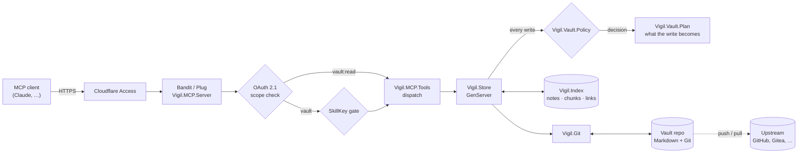
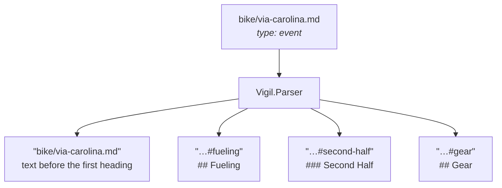
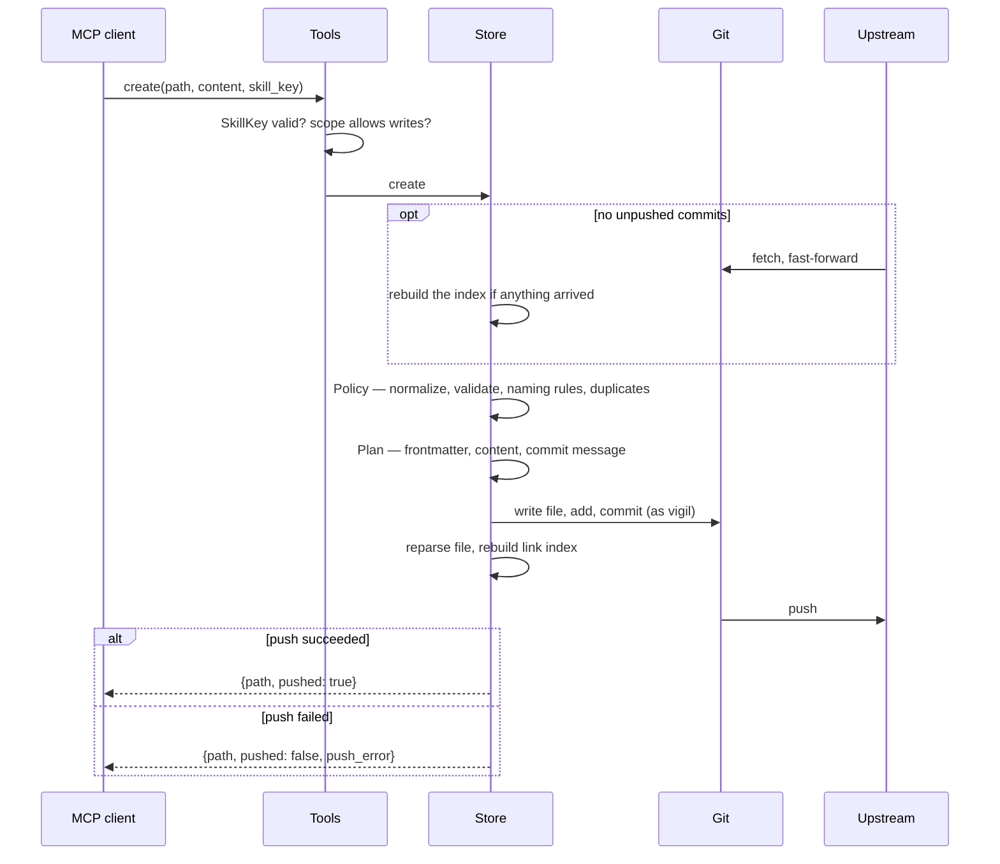
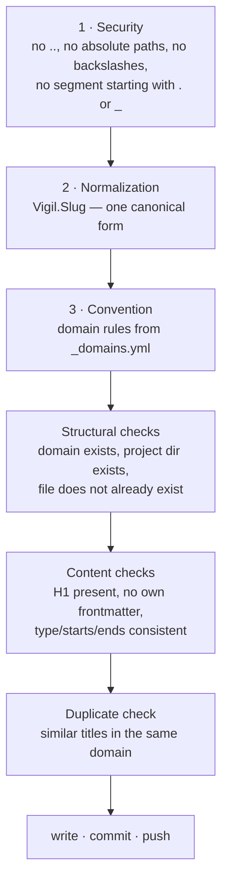
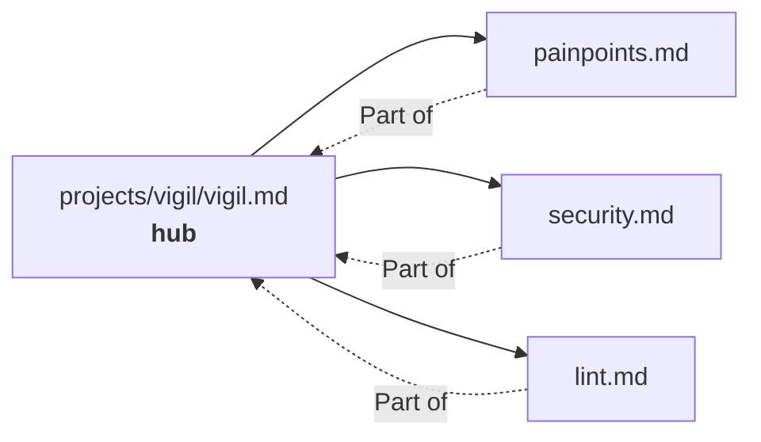
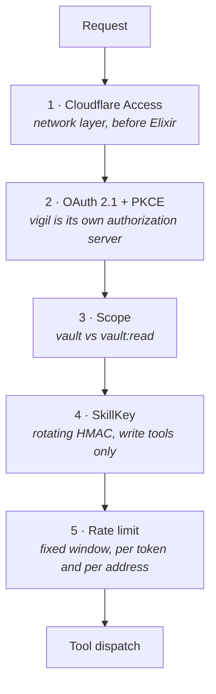

# User guide

[Back to vigil](../README.md) · [Documentation index](README.md)

**A self-hosted MCP server that turns a folder of Markdown files into long-term memory for an AI assistant.**

Your notes stay plain Markdown in a Git repository you own. vigil indexes them
in memory, serves them over the [Model Context Protocol](https://modelcontextprotocol.io),
and writes changes back as ordinary Git commits — one commit per edit, pushed
immediately.

No database. No vendor lock-in. If you delete vigil tomorrow, you still have a
folder of Markdown files and their full history.

[](../LICENSE)


---

## Table of contents

- [Why this exists](#why-this-exists)
- [How it works](#how-it-works)
- [The vault](#the-vault)
- [Quickstart](#quickstart)
- [Tools](#tools)
- [Writing safely](#writing-safely)
- [Links between notes](#links-between-notes)
- [Security model](#security-model)
- [Configuration](#configuration)
- [Operations](#operations)
- [Revoking access](#revoking-access)
- [Editing by hand](#editing-by-hand)
- [Adopting an existing vault](#adopting-an-existing-vault)
- [Troubleshooting](#troubleshooting)
- [Development](#development)
- [Design decisions](#design-decisions)
- [Further reading](#further-reading)
- [License](#license)

---

## Why this exists

Assistant memory is usually a black box: you cannot read it, diff it, grep it,
or take it with you. vigil takes the opposite position — **the files are the
truth**:

- **Plain Markdown.** Readable in any editor, Obsidian included.
- **Git is the storage layer.** Every write is a commit with a real message.
  History, blame and rollback come for free.
- **The index is disposable.** It lives in memory and is rebuilt from the files
  at every start. Losing it costs a restart, not data.
- **Chunk-level retrieval.** Notes are split at headings, so the assistant
  fetches one section — not a 3000-word file — into its context.

---

## How it works



The index only exists in process memory — a plain value held in
`Vigil.Store`'s state — and is rebuilt from the Git working tree at every
start and on every `reload`. The single source of truth is the vault
repository; restarting `Vigil.Store` never loses data, only a warm index.

Clients connect to `/mcp` over the Streamable HTTP transport. vigil speaks the
MCP protocol versions **2025-11-25**, **2025-06-18** and **2025-03-26**, answers
`initialize` with the client's version when it is one of these and with
2025-11-25 otherwise, and holds every later request in the session to the
version it negotiated. See [Protocol versions](design.md#protocol-versions).

### A note becomes chunks

A note is split at its headings. Each chunk is independently addressable and
independently retrievable — that is what keeps the assistant's context small.



`search` returns those chunk ids; `read` fetches exactly one of them.

### What happens on a write

Every write is validated, committed and pushed before the client gets an
answer. Before it, the server fetches from the remote and fast-forwards onto
whatever was pushed there in the meantime, as long as it holds no unpushed
commits of its own — so a human's push does not make the next write's push
fail. If only the push fails, the write still succeeded: the answer says
`pushed: false` and carries the reason in `push_error`, so the client knows
without being invited to retry — a retried `append` would append twice, unless
it carries the same `request_id` as the first call. The commit goes out with
the next successful push, or within 15 minutes through the safety-net cron job. A write whose *commit* fails is an error, and the vault is
left as it was: a deleted note is back, a moved note is at its old path, and
nothing is left staged for the next commit to pick up.



---

## The vault

A vault is a Git repository with one directory per **domain**:

```
vault/
├── _domains.yml          # the domains and their rules
├── admin/
├── gear/
├── home/
├── journal/
│   └── 2026-07-09.md
├── projects/             # one subdirectory per project
│   └── vigil/
│       ├── vigil.md      # hub note
│       └── painpoints.md # spoke
├── training/
└── skills/               # instructions for the assistant, never indexed
```

Domains are read from the filesystem at runtime — adding one means creating a
directory and an entry in `_domains.yml`, then calling `reload`. No code change.

### Frontmatter

Three fields, nothing else:

```yaml
---
type: reference      # reference | decision | event
starts: 2026-07-10T17:00:00+02:00   # only for type: event
ends:   2026-07-12T20:00:00+02:00   # only for type: event
---
```

| type | meaning | ages? |
|---|---|---|
| `reference` | a fact about the world | no |
| `decision` | a fact about the vault owner, a choice they made | yes — `lint` flags stale ones |
| `event` | has a start and an end; surfaces in `current` | it passes |

### `_domains.yml`

A domain is either a plain description, or a map that adds naming rules:

```yaml
gear:      "Equipment: bikes, components, maintenance"
projects:  "Software projects. One subdirectory per project"

journal:
  description: "Chronological, hidden from the default search"
  naming:
    pattern: '^\d{4}-\d{2}-\d{2}\.md$'   # filenames must match this
    scope: filename                       # or: relpath
    suggestion: date                      # or: slug — shapes the error message
    hint: "Journal notes are named YYYY-MM-DD.md"
```

Violating a naming rule returns an error containing the rule *and* a concrete
suggested path. A broken regex in the config is logged and ignored — a bad
config never blocks writing.

---

## Quickstart

### Try it locally

Follow the [local quickstart](../README.md#quickstart) for an isolated demo
vault with a local Git remote. A remote is required for successful writes:
vigil commits and pushes every edit, even in development.

### Deploy on a server

On a fresh Debian 13 server or container, as root. A Proxmox LXC needs the
`nesting=1` feature — the unit's sandboxing (`ProtectSystem`, `PrivateTmp`)
fails with `226/NAMESPACE` without it — and 2 GB of RAM for the build.
`setup.sh` is idempotent; `init.sh` protects existing secrets and refuses to
overwrite them unless explicitly forced.

```bash
apt-get update && apt-get install -y git
git clone https://github.com/64x-lunicorn/vigil.git /root/vigil && cd /root/vigil
sudo ./scripts/setup.sh --hostname vault.example.org   # packages, user, deploy key, tunnel
```

`setup.sh` prints the service user's public key. Add it to the vault
repository as a deploy key **with write access**, and set up a Cloudflare
Access application for the hostname. Then:

```bash
sudo ./scripts/init.sh --new-vault          # vault, secrets, build, start, verify
```

or, to adopt a vault you already have:

```bash
sudo ./scripts/init.sh --existing-vault git@github.com:you/vault.git
```

Later updates run from the checkout `setup.sh` made, so there is one copy of
the code on the host: `cd /opt/vigil/repo && sudo ./scripts/update.sh`.

`setup.sh` installs packages, creates the `vigil` system user, sets up its SSH
identity (verifying GitHub's host key fingerprint) and routes its GitHub SSH
over `ssh.github.com:443` with keepalives (`--github-ssh-port 22` or `auto` to
change that), clones the code, installs
Hex and rebar3 for the service user and the systemd unit, and creates the
Cloudflare tunnel with its DNS record (`--tunnel-name` if a tunnel called
`vigil` already belongs to another host). `init.sh` provisions the vault, generates secrets,
audits dependencies, runs the test suite, builds a release, starts the service,
seeds two OAuth tokens, and finishes with an acceptance check.

`init.sh` prints both tokens **once** at the end. After that they exist
nowhere: `/var/lib/vigil/oauth_tokens.dets` keeps only their SHA-256 digests,
so a lost token is seeded again, not recovered. Each lives 90 days, and either
can be revoked sooner (see [revoking access](#revoking-access)). With
`--keep-token` — moving an instance whose clients keep the tokens they hold —
no token is minted for the owner and none is printed; the skill bootstrap and
the acceptance check use two of their own that live 15 minutes. It also
installs the push safety net as `/etc/cron.d/vigil-push-safety-net`, which
runs `scripts/push_pending.sh` every 15 minutes. An adopted vault keeps its
own `vigil-vault-conventions` skill; the template is only written when the
vault has none.

---

## Tools

Eighteen tools. "RW" means the token needs the `vault` scope; a token with
any other scope, `vault:read` included, is not shown them on `tools/list` and
gets an explicit error if it calls one anyway. "Key" means the call must carry
a current `skill_key`. Every write also takes an optional `request_id` (see
"Writing safely").

| Tool | Parameters | Returns | Role | Key |
|---|---|---|---|:--:|
| `search` | query, domain?, type?, prefer?, limit? | ranked hits with previews, plus `hub` when unambiguous | RO/RW | – |
| `read` | id, backlinks? | one chunk with its `hash`, or a note's table of contents (each entry with its `hash`) plus `links` counters | RO/RW | – |
| `links` | id, direction?, depth? | resolved outgoing/incoming references | RO/RW | – |
| `create` | path, type, content, starts?, ends?, force?, create_dirs? | `{path, pushed, path_normalized_from?}` | RW | ✓ |
| `append` | path, heading?, content | `{path, pushed}` | RW | ✓ |
| `replace_section` | id, content, if_match? | `{path, pushed}` | RW | ✓ |
| `rewrite_note` | path, content, confirm? | `{path, pushed, broken_chunk_links}` | RW | ✓ |
| `delete_section` | id, if_match? | `{path, pushed}` | RW | ✓ |
| `update_frontmatter` | path, type, starts?, ends? | `{path, pushed}` | RW | ✓ |
| `delete_note` | path, confirm | `{path, deleted, pushed, broken_backlinks}` | RW | ✓ |
| `move_note` | from, to, confirm, update_links? | `{from, to, pushed, broken_backlinks, updated_links?}` | RW | ✓ |
| `lint` | – | duplicate/sentence headings, broken links, overlong notes, stale decisions | RO/RW | – |
| `current` | – | current time plus active and nearby events | RO/RW | – |
| `reload` | – | `{reloaded, pull_failed?}` | RO/RW | – |
| `status` | – | `{healthy, index_loaded, writer_answers, ahead, behind, last_push}` | RO/RW | – |
| `skill_list` | – | skills with their descriptions | RO/RW | – |
| `skill_read` | name | skill content, prefixed with the current SkillKey | RO/RW | – |
| `skill_write` | name, content | `{name, pushed}` | RW | ✓ |

Every tool also publishes a title and the four MCP hints, so a client can tell
`delete_note` from `read` before asking you to approve it. The read tools are
read-only. `delete_note`, `move_note`, `rewrite_note`, `delete_section`,
`replace_section`, `update_frontmatter` and `skill_write` are destructive;
`create` and `append` only add. `reload` is callable with `vault:read` and is
still neither read-only nor closed-world: it moves the vault to whatever the
remote holds, and has its own, smaller rate limit
(`VIGIL_RELOAD_RATE_LIMIT_RPM`), since each call pulls and reparses the vault.

`limit` is 1–25 (default 10) and `depth` is 1 or 2. A value outside the range
is a tool error naming the range, not a silently clamped result: a caller told
it got 25 hits of the 100 it asked for could not tell that from having asked
for 25.

`update_frontmatter` also gives a note without frontmatter the block it lacks,
leaving everything already in the file as its body. `rewrite_note` preserves
the block it finds, so it refuses a note that has none and points at
`update_frontmatter`. Both refuse a block that opens and never closes; that one
needs a human.

### Paths are normalized, not rejected

`create` and `move_note` canonicalize the path before anything else: lowercase,
transliterated diacritics (`ü`→`ue`, `ø`→`oe`), non-alphanumeric runs collapsed
to a single hyphen, truncated at 80 characters on a hyphen boundary.

```
"projects//Vigil/Pain Points.md"  →  "projects/vigil/pain-points.md"
"bike/Café Übersicht!!.md"        →  "bike/cafe-uebersicht.md"
```

When the path changed, the response contains `path_normalized_from`. **Use the
returned `path`** — that is where the note actually lives.

The same slug function produces chunk ids, so file names and `[[…]]` references
can never drift apart. Before changing that function, `mix vigil.slug_diff
<vault>` shows exactly which chunk ids would move.

---

## Writing safely

Three layers guard every write, in this order:



Beyond that:

- **Destructive operations need `confirm: true`.** `delete_note` and
  `move_note` always; `rewrite_note` only past a shrink threshold (removing
  more than half the sections, or more than 20 headings). The error says which
  threshold tripped and how many sections would go.
- **`delete_note` reports the damage.** Without `confirm`, the error lists the
  notes that currently link to the target; a confirmed call returns the same
  list as `broken_backlinks`.
- **`move_note` can take its links along.** A move reports the links it broke
  as `broken_backlinks` and leaves them as they are. With `update_links: true`
  it rewrites them instead, in the same commit as the move: every wiki link and
  Markdown link that pointed at the note now points at its new path, with its
  link text, alias and `#fragment` unchanged, and `updated_links` lists the
  notes it changed. A basename link stays a basename where that still finds
  the note, and becomes the note's path where it would not. Links in code, in
  headings and in frontmatter are left alone, as the link index ignores them
  too.
- **`rewrite_note` reports the section links it broke.** A rewrite that drops
  or renames a section another note links into lists those links as
  `broken_chunk_links`, each as `{from, to}` — the linking chunk and the
  section it pointed at.
- **A retried write is applied once.** A write can outlive the client's
  timeout and still complete, and the client retries. Pass a `request_id`,
  unique per write: a retry with the same one answers the first result with
  `already_applied: true` and writes nothing, and the same id with a different
  write is refused. Ids are remembered for an hour, at most the last 1000,
  and a restart forgets them.
- **Section edits can name the content they read.** `read` returns a `hash`
  per section; pass it to `replace_section` or `delete_section` as `if_match`,
  and the edit is refused if the id now holds other content — as it does
  after a `delete_section` renumbered `#setup-2` into `#setup`. An edit whose
  heading is no longer on the line the index says is refused too, and asks
  for a `reload`.
- **A failed write never takes the server down.** Permission errors, a full
  disk, a read-only filesystem — all become plain error messages while `read`
  and `search` keep answering.
- **The SkillKey.** Every write tool requires a rotating HMAC token that the
  assistant can only get by calling `skill_read` on the conventions skill. The
  point is not access control (the OAuth token already did that) — it is that
  the assistant has demonstrably *read the writing rules* in this session.

---

## Links between notes

vigil indexes `[[wikilinks]]` and `[markdown](links.md)` and resolves them
against the actual vault:

| form | example |
|---|---|
| wikilink | `[[painpoints]]` |
| with a chunk | `[[painpoints#deploy-error]]` |
| with an alias | `[[painpoints\|known issues]]` |
| markdown link | `[known issues](painpoints.md)` |

Links inside fenced code blocks and inline code are **not** indexed — otherwise
example code would register as real references.

**Resolution.** A target containing `/` is treated as a vault-relative path.
Otherwise the basename is looked up in the same folder first, then the same
domain, then vault-wide. More than one match at a stage means `ambiguous`, with
all candidates listed. No match means `broken` — which is not an error: a link
to a note that does not exist yet is a legitimate placeholder.

**Hub and spoke.** When a note has exactly one incoming link, `search` attaches
that note as `hub`. A hit in a spoke therefore brings its entry point along, at
no extra round trip. With several incoming links the field is omitted rather
than guessed.



---

## Security model



1. **Cloudflare Access** sits in front of the service. `init.sh` aborts if the
   public endpoint answers with anything other than 403 — that is, unless
   Access is actually in place.
2. **OAuth 2.1** with Authorization Code + PKCE. Dynamic Client Registration
   and Client-ID Metadata Documents are both supported. No static bearer token.
3. **Scopes.** `vault` for full access, `vault:read` for read-only clients.
4. **SkillKey.** Rotating HMAC derived from `VIGIL_SKILLKEY_SECRET`, required
   by every write tool. The secret is random bytes of its own, never the
   consent password: every key is handed to a client and ends up in chat
   transcripts, and one keyed with a password could be tested against offline.
5. **Rate limiting**, fixed window — per access token behind `/mcp`, per
   client address in front of the authorization server.

Before layers 2 to 5, every request to `/mcp` and every POST to the
authorization server has its `Origin` checked, and one sent by a page on
another site is refused with 403 — see [browser origins](#browser-origins).

Layer 5 is the one to read carefully, because there are three limits and they
cover different things:

| Limit | Keyed on | Budget | Covers |
|---|---|---|---|
| `Vigil.RateLimit` at `/mcp` | access token | `VIGIL_RATE_LIMIT_RPM` per minute | every `/mcp` request, and only after the token validates |
| `Vigil.RateLimit` for `reload` | access token | `VIGIL_RELOAD_RATE_LIMIT_RPM` per minute | `reload` calls, on top of the row above; past it `reload` answers a rate-limit error |
| `Vigil.RateLimit` at the OAuth endpoints | client address | `VIGIL_OAUTH_RATE_LIMIT_RPM`, `VIGIL_OAUTH_REGISTER_RATE_LIMIT_RPM` per minute | `/oauth/register`, `/oauth/authorize`, `/oauth/token` — all reachable without a token |
| `Vigil.OAuth.Store` | client address | 5 per 15 minutes | wrong passwords on the consent form, and nothing else |

The middle row is what bounds an unauthenticated caller: without it, `/authorize`
would fetch a CIMD document from an address the caller chose as often as it
liked, `/register` would write a `:dets` row and fsync per call, and `/token`
would answer guesses for free. Cloudflare Access is what keeps those from being
reachable at all on this deployment; the limits are the defence behind it.

Which address the per-address limits count against is a configured question,
not a guess: see [the two proxy settings](#the-two-proxy-settings-and-why-they-default-to-unset).

The systemd unit runs with `ProtectSystem=strict`, `ProtectHome=true`,
`PrivateTmp=true`, `NoNewPrivileges=true`, and `/var/lib/vigil` as the only
writable path.

---

## Configuration

All settings come from environment variables in `/etc/vigil/env`
(see [`deploy/vigil.env.example`](../deploy/vigil.env.example)).

| Variable | Default | Purpose |
|---|---|---|
| `VIGIL_VAULT_PATH` | **required in prod**; `test/fixtures/vault` in dev | path to the vault's Git clone |
| `VIGIL_PORT` | `4000` | HTTP port |
| `VIGIL_BIND` | `127.0.0.1` | listen address; loopback keeps the LAN from bypassing Cloudflare Access. Widen it only for a proxy on another host |
| `VIGIL_GIT_REMOTE` | `github` | remote used for pull **and** push; must be a remote of the vault clone |
| `VIGIL_GIT_BRANCH` | the clone's checked-out branch when it tracks a branch on the remote, otherwise `main` | branch used for pull **and** push; must exist and track `<remote>/<branch>` (`git branch -vv`) |
| `VIGIL_TZ` | `Europe/Berlin` | timezone for `current`, envelopes, relative times |
| `VIGIL_EXCLUDE` | empty | comma-separated directory names that are never parsed, at any depth — `secret` hides `projects/secret/` as well as `secret/` |
| `VIGIL_ISSUER` | **required in prod**; `http://localhost:4000` in dev | OAuth issuer |
| `VIGIL_RESOURCE` | **required in prod**; `http://localhost:4000/mcp` in dev | canonical MCP endpoint URI (audience) |
| `VIGIL_AUTH_PASSWORD` | — | consent password, **required, min. 12 characters** |
| `VIGIL_SKILLKEY_SECRET` | — | SkillKey HMAC secret, **required, at least 32 random bytes**, base64 or hex (`openssl rand -base64 48`); never the consent password |
| `VIGIL_STATE_DIR` | **required in prod**; `tmp/oauth_state` in dev | directory for the three `:dets` files |
| `VIGIL_ALLOWED_ORIGINS` | empty | comma-separated browser origins, besides the issuer's own, that may send a request to `/mcp` and the OAuth endpoints, e.g. `http://localhost:6274`. See [browser origins](#browser-origins) |
| `VIGIL_TRUSTED_PROXY_HEADER` | unset | header carrying the real client address, e.g. `CF-Connecting-IP` |
| `VIGIL_TRUSTED_PROXIES` | empty | addresses or CIDR blocks whose forwarded header is believed |
| `VIGIL_SKILLKEY_TTL` | `3600` | SkillKey rotation window in seconds |
| `VIGIL_RATE_LIMIT_RPM` | `60` | max `tools/call` per minute per access token |
| `VIGIL_RELOAD_RATE_LIMIT_RPM` | `6` | max `reload` per minute per access token, on top of the budget above |
| `VIGIL_OAUTH_RATE_LIMIT_RPM` | `30` | max `/oauth/authorize` and `/oauth/token` per minute per client address |
| `VIGIL_OAUTH_REGISTER_RATE_LIMIT_RPM` | `5` | max `/oauth/register` per minute per client address |
| `VIGIL_VAULT_OWNER` | `the vault owner` | who the notes belong to — shapes the writing instructions |
| `VIGIL_VAULT_LANGUAGE` | `English` | language the **notes** are written in; vigil's own output is always English |

Every setting is checked once, when the service starts and before anything
else does. A bad one stops the start, and the journal names every variable that
failed and what it expected, all in one message:

- `VIGIL_PORT` must be an integer from 1 to 65535.
- `VIGIL_SKILLKEY_TTL`, `VIGIL_RATE_LIMIT_RPM`, `VIGIL_RELOAD_RATE_LIMIT_RPM`
  and the two OAuth budgets must be positive integers. `0`, `-5` or `60rpm` is
  refused, not replaced by the default.
- `VIGIL_TZ` must be a timezone name the timezone database knows, such as
  `Europe/Berlin`. An unknown one is refused rather than quietly becoming UTC.
- `VIGIL_BIND` must be an IP address.
- Every entry in `VIGIL_ALLOWED_ORIGINS` must be an origin — scheme and host,
  an optional port, no path: `https://claude.ai`, not `claude.ai` or
  `https://claude.ai/mcp`.
- `VIGIL_AUTH_PASSWORD` must be at least 12 characters. The message names the
  variable and never shows the value.
- `VIGIL_SKILLKEY_SECRET` must be set and decode, as base64 or hex, to at least
  32 bytes — a long phrase is refused however long it is — and must not be the
  consent password. The message names the variable, says how to generate one
  and never shows the value.
- In prod, `VIGIL_ISSUER` and `VIGIL_RESOURCE` must be `https` URLs, and the
  resource must sit on the issuer's origin (same scheme, host and port):
  `https://vault.example.org` and `https://vault.example.org/mcp`, not
  `https://mcp.example.org`. In dev, the `http://localhost` defaults pass.
- In prod, `VIGIL_VAULT_PATH`, `VIGIL_STATE_DIR`, `VIGIL_ISSUER` and
  `VIGIL_RESOURCE` must be set.
- `VIGIL_VAULT_PATH` must be a git clone, `VIGIL_GIT_REMOTE` one of its
  remotes, and `VIGIL_GIT_BRANCH` one of its branches, tracking the branch of
  the same name on that remote. Fix a missing upstream with
  `git branch --set-upstream-to=<remote>/<branch> <branch>`; the message
  prints it.

The scripts read the remote and the branch from `/etc/vigil/env` too, so a
vault on `master`, or a remote called `origin`, is two lines there and nothing
else.

The last two only affect the instructions handed to the MCP client on connect.
If your vault is in German, set `VIGIL_VAULT_LANGUAGE=German` and the assistant
will keep writing German notes.

### Browser origins

A browser that sends a request to another site says which site's page sent it,
in the `Origin` header, and a page cannot change what that says. vigil uses it
to refuse a request a page on some other site got a browser to make — through
DNS rebinding onto a server bound to `127.0.0.1`, most of all, which is the
local quickstart. `/mcp` and the OAuth endpoints that change something
(`register`, the consent form's POST, `token`) answer such a request 403,
before anything else is looked at.

Three kinds of request pass:

- one with no `Origin` at all: Claude, Claude Code and every other MCP client
  that is a program rather than a web page;
- one from the issuer's own origin: the consent form posting back to where it
  was served from;
- one from an origin listed in `VIGIL_ALLOWED_ORIGINS`.

Leave the list empty unless a browser-based client talks to vigil directly —
the MCP Inspector's web UI, say, at `http://localhost:6274`. An origin is
scheme, host and port: `http://localhost:4000` and `http://127.0.0.1:4000` are
two, so open the consent page on the host `VIGIL_ISSUER` names.

### The two proxy settings, and why they default to unset

vigil's rate limits are keyed per client address, and `conn.remote_ip` — the
peer of the TCP connection — is the proxy, not the client, in the deployment
above. Left alone, that makes every limit one global bucket: stricter than
intended rather than weaker, and exhaustible by anyone who can reach
`/oauth/authorize`.

Reading `X-Forwarded-For` is not the fix on its own. The header is written by
whoever sent the request unless something in front of vigil overwrites it, so
believing it unconditionally turns a global limit into no limit at all — every
attempt simply claims a new address. So vigil believes a header only when told
which one and told which peers may set it:

```
VIGIL_TRUSTED_PROXY_HEADER=CF-Connecting-IP
VIGIL_TRUSTED_PROXIES=173.245.48.0/20,103.21.244.0/22
```

**Set both or neither.** A header name without a trusted peer is ignored, and
a trusted peer without a header name has nothing to read. With neither set,
behaviour is exactly what it was before the settings existed.

**Setting them wrong is worse than leaving them unset.** If `VIGIL_TRUSTED_PROXIES`
includes an address that is not in fact a sanitizing proxy — the whole of
`0.0.0.0/0`, say, or a range vigil is reachable from directly — then any caller
in that range gets a fresh rate-limit bucket per request just by naming a new
address. Put the proxy's own addresses there and nothing else. For Cloudflare
that is the published
[IP ranges](https://www.cloudflare.com/ips/), and the header to name is
`CF-Connecting-IP`, which Cloudflare overwrites rather than appends to.

When several hops are listed, vigil takes the rightmost one it did not add
itself: proxies append what they saw, so anything further left is a claim from
outside. A hop that is not an address at all stops the walk and the peer is
used instead — otherwise a caller could inject garbage to push the walk onto a
value it chose.

---

## Operations

```bash
sudo ./scripts/update.sh                 # move to origin/main
sudo ./scripts/update.sh --to v1.2.3     # to a specific tag or commit
sudo ./scripts/update.sh --rollback      # back to the previous release
```

`update.sh` builds the new code as its own release and switches by symlink
(`stop` → symlink → `start`, never `restart`), then runs the acceptance check.
If that fails it **rolls back automatically**, restarts, and checks again —
exiting 3 with `Update rolled back to <old-sha>. The service is running again.`

- **Logs:** `journalctl -u vigil -f`
- **Vault state:** `git -C /var/lib/vigil/vault log --oneline -5`
- **Health check:** `sudo ./scripts/init.sh --check-only` — safe against a
  running service
- **Is it serving, and in step with the remote?** `curl -s localhost:4000/healthz`
  on the host (see below), or the `status` tool from a client
- **Add a domain:** create the directory, add it to `_domains.yml`, call
  `reload`. No code change, no restart.

### `/healthz` and `status`

`GET /healthz` answers on the host itself, without a token, and nowhere else:
a request that did not come from a loopback address, names a host other than
`localhost`, `127.0.0.1` or `::1`, or arrives through a proxy (it carries
`X-Forwarded-For`, `Forwarded`, `X-Real-IP` or `CF-Connecting-IP`) gets a 404.
It answers 200 when the index is loaded and the writer answers within five
seconds, 503 otherwise:

```json
{"healthy": true, "index_loaded": true, "writer_answers": true,
 "ahead": 0, "behind": 0, "last_push": {"pushed": true, "at": "2026-09-29T08:12:03Z"}}
```

`ahead` counts commits the server holds and has not pushed; `behind` counts
commits the remote holds and the server has not adopted, as of the last fetch —
the server fetches before every write. `last_push` is `null` until the first
write since the service started. Neither decides the status code: a failed push
is reported, not a reason to call the service down. `/healthz` leaves out the
push's error text; the `status` tool, which needs a token, carries it as
`last_push.error`.

`update.sh` waits for `/healthz` after every start, and its acceptance check
asks it too. A push that fails also emits the telemetry event
`[:vigil, :push, :failed]`, for anyone attaching a handler.

**Updating a host set up before `VIGIL_SKILLKEY_SECRET` existed.** Its env file
has no such line, and a release that needs it refuses to start, naming the
variable. `update.sh` checks for the line in its preflight and stops there
(exit 2, nothing changed, the old release still running), printing the command
below. Add the secret once, then update:

```bash
echo "VIGIL_SKILLKEY_SECRET=$(openssl rand -base64 48)" | sudo tee -a /etc/vigil/env >/dev/null
sudo ./scripts/update.sh
```

Outstanding SkillKeys stop working with the switch; an assistant gets a new one
from `skill_read`, as after any rotation. The consent password and every OAuth
token are untouched.

---

## Revoking access

A **grant** is one authorization: a client that got past the consent page, or
a token `init.sh` seeded. It is the unit of revocation — its access and
refresh tokens go together, and are refused from the very next request on,
at `/mcp` and at `/oauth/token` alike. `scripts/grants.sh` lists and revokes
them on the host, through `bin/vigil rpc` against the running service; it
never prints a token value, because the server does not keep one.

```bash
sudo ./scripts/grants.sh list                    # grant id, client, client id, scope, issued, expires
sudo ./scripts/grants.sh clients                 # registered clients and how many grants each holds
sudo ./scripts/grants.sh revoke <grant-id>       # one grant: its access and refresh tokens
sudo ./scripts/grants.sh revoke-all              # every grant; asks you to type "yes" (or pass --yes)
sudo ./scripts/grants.sh delete-client <client-id>  # a client, and every grant it holds
```

- **A seeded grant** shows `(seeded)` as its client: it came from `init.sh` or
  `mix vigil.seed_token`, not from a consent. Seeded tokens live **90 days**
  by default (`--ttl-days`/`--ttl-seconds` on the task say otherwise), so one
  nobody revokes still ends.
- **Issued** is when the grant began. Rotating a refresh token keeps its grant
  and its date; **expires** is when its last token does, 30 days after the
  latest rotation for a client's grant. When a grant was last *used* is not
  recorded: counting it would be a disk write on every request.
- **Revoking everything** also drops any authorization code not yet
  redeemed. Clients stay registered — a registration grants nothing without
  the consent password — and every client has to consent again. Do this after
  **rotating the consent password**: a new password stops new consents and
  revokes nothing already granted.
- **Deleting a client** deletes its registration and its outstanding codes
  and revokes every grant it holds. A client that named itself by a metadata
  URL has no registration; deleting it revokes its grants. Either can come
  back only through the consent page.
- Tokens from before grants existed carry none; they are listed together
  under `(none)`, and only `revoke-all` reaches them.

Exit codes: 0 done, 1 refused by the service (an unknown id, printed behind
`error:`) or `rpc` failed, 2 wrong arguments or the service is not running, 4
`revoke-all` not confirmed.

---

## Editing by hand

vigil is the only writer of the vault on the server. You can still change
notes yourself — in Obsidian or any editor — as long as the change reaches the
server as a commit through the remote, not as a file edited in
`/var/lib/vigil/vault`.

1. **Work in a clone of your own.** Clone the vault's remote (the one vigil
   pushes to, e.g. GitHub) and open that directory as an Obsidian vault.
   Obsidian's `.obsidian/` stays local — the adoption phase already put it in
   `.gitignore`.
2. **Start from the current state:** `git pull --rebase`.
3. **Edit, commit under your own name, push:**

   ```bash
   git add -A
   git commit -m "Rework the training plan"
   git push
   ```

   A rejected push means vigil wrote something in the meantime —
   `git pull --rebase` and push again.
4. **Call `reload`, or don't.** The server pulls `--ff-only` and rebuilds its
   index; a `vault:read` token is enough. Without it, the server adopts your
   commits before its next write anyway: it fetches and fast-forwards whenever
   it holds no unpushed commits of its own, so the write lands on top of yours
   and its push goes through. `reload` is what makes your edit visible to
   reads before then.
5. **Optionally call `lint`** to catch frontmatter or naming problems the edit
   introduced.

Your commits keep your identity, so `git log --author=vigil` still separates
what the assistant wrote from what you wrote.

**Mind the chunk ids.** Renaming a heading changes its chunk id, and links to
the old id break. `links` and `lint` show what broke.

**If `reload` answers `pull_failed`**, or `status` shows both `ahead` and
`behind` above zero, the server has a commit the remote does not, almost always
a write whose push failed. vigil does not merge, and while it holds such a
commit it does not fast-forward before a write either. Reconcile
on the server as the service user, then call `reload` again:

```bash
sudo -u vigil git -C /var/lib/vigil/vault log --oneline @{u}..
sudo -u vigil git -C /var/lib/vigil/vault pull --rebase
sudo -u vigil git -C /var/lib/vigil/vault push
```

---

## Adopting an existing vault

A vault that predates vigil rarely satisfies its assumptions: no `.obsidian/`
in `.gitignore`, missing `_domains.yml` entries, notes without frontmatter,
non-canonical filenames. `init.sh --existing-vault` therefore runs an adoption
phase that separates two kinds of finding:

**Applied automatically** (additive, committed as one `vault adoption` commit):
`.gitignore` entry for `.obsidian/` including untracking it, local git identity
and `commit.gpgsign false`, the branch's upstream → `<remote>/<branch>` as
`VIGIL_GIT_REMOTE` and `VIGIL_GIT_BRANCH` say (a clone's `origin` is renamed
to the remote; the branch is the one the clone checked out), missing
`_domains.yml` entries (without naming rules — those are a human decision),
directory permissions.

**Reported only** (never repaired automatically, never blocking): frontmatter
problems (a note without any can be given a block by `update_frontmatter`),
non-canonical filenames with a suggested `move_note`, the chunk-id migration
risk, domains that exist only in the config, unpushed commits, headings that
have lost the blank line above them, notes past the consolidation threshold, an
extra remote with unclear purpose.

The same check runs standalone and strictly read-only:

```bash
sudo ./scripts/init.sh --check-only                 # /var/lib/vigil/vault
sudo ./scripts/init.sh --check-only --vault /path   # somewhere else
```

Exit 0 (no findings) / 2 (vault unreadable) / 3 (findings present), so it is
usable from cron or CI. Worth running before every `update.sh`, and after
editing the vault in another tool.

---

## Troubleshooting

| Symptom | Cause | Fix |
|---|---|---|
| Requests hang, then fail with HTTP 500; the journal shows `GenServer.call ... timeout` | the single writer is blocked for over two minutes, almost always on a git pull or push that cannot reach the remote | check `journalctl -u vigil` and the network path to the remote; git's own connect and stall timeouts should normally end the call well before this |
| Service refuses to start: "vigil refuses to start: VIGIL_… is not set" or "VIGIL_… must be …" | a required setting is missing from `/etc/vigil/env`, or one is malformed | fix every variable the message names (see [Configuration](#configuration) and `deploy/vigil.env.example`) |
| Service fails with `226/NAMESPACE` | an LXC container without `nesting=1` cannot give the unit its sandbox | enable the container's nesting feature in Proxmox and restart it |
| Service will not start, journal shows an OAuth store error | `Vigil.OAuth.Store` could not open the `dets` files | check ownership and permissions of `VIGIL_STATE_DIR`. A broken OAuth store deliberately takes the whole service down — a service that cannot authenticate anyone is worse than no service |
| `git pull failed: Host key verification failed` | the service user's `known_hosts` is empty | re-run `setup.sh` (idempotent) |
| `ssh: connect to host github.com port 22: Connection timed out`, while other hosts reach GitHub | the network blocks outbound 22 for this host, often only after a burst of connections | re-run `setup.sh` with the default `--github-ssh-port 443` |
| `Permission denied (publickey)` | deploy key not registered, or registered without write access | add the key from `/var/lib/vigil/.ssh/id_ed25519.pub`, enable "Allow write access" |
| Writes fail with "Missing or expired SkillKey" | key not passed, or older than two rotation windows | call `skill_read` on `vigil-vault-conventions` and use the key it returns — the error case returns one too |
| `create` fails with "does not match the schema for domain" | the domain has a `naming.pattern` the path does not satisfy | the error contains a valid suggestion; or adjust `naming` in `_domains.yml` |
| Chunk ids change unexpectedly after a deploy | the slug logic changed without checking the migration diff | run `mix vigil.slug_diff <vault>` *before* deploying |
| Client gets 401 | token wrong, expired or revoked (`sudo ./scripts/grants.sh list`) | redo the OAuth flow. Never run `mix vigil.seed_token` against a running service — it opens the dets files a second time and the token it writes is never seen |
| A write tool answers "Read-only token: write access denied." | the token's scope is not `vault` (for example `vault:read`) | connect with a `vault` token |
| Client gets 403 from the endpoint, not from Elixir | Cloudflare Access service token missing in the client | fix the Access configuration — never disable Access to "solve" this |
| Changes do not appear on other devices; writes answer `pushed: false` | push failed, commit is local | the safety-net cron retries every 15 minutes; check `journalctl -t vigil-push` and `git -C /var/lib/vigil/vault rev-list --count @{u}..` |

---

## Development

```bash
mix deps.get
mix test
```

`mix test` runs **without** `MIX_ENV=prod`. In `prod`, Mix loads the production
config and would reach for `/var/lib/vigil`; `config/runtime.exs` pins fixed,
safe paths for `MIX_ENV=test` regardless of what is in the environment, so a
stray `VIGIL_VAULT_PATH` cannot make a green test run meaningless.

`scripts/*.sh` are covered separately — outside `mix test` — by
`bash scripts/test/check_only_test.sh`, which exercises `init.sh --check-only`
against a throwaway fixture vault without needing root or a real
`/opt/vigil/repo` install (see the `VIGIL_INIT_TEST_STUBS` seam in `init.sh`),
and by `bash scripts/test/grants_test.sh`, which drives `grants.sh` against a
fake release (the `VIGIL_GRANTS_TEST_STUBS` seam).

```
lib/vigil/
├── application.ex       # supervisor
├── settings.ex          # what the deployment says about itself, resolved once
├── settings/check.ex    # every setting checked once at boot, a bad one named
├── store.ex             # GenServer — loading, the write sequence, the mailbox
├── index.ex             # notes, chunks and links as one plain value, and the search over it
├── parser.ex            # file → frontmatter + chunks + raw links
├── link_index.ex        # resolves [[…]] and path links into an out/in index
├── markdown.ex          # the one reading of a note: headings, frontmatter, how a file ends
├── slug.ex              # the single canonical slug implementation, and path safety
├── events.ex            # the event windows behind current and snapshot
├── clock.ex             # the vault's one notion of "now"
├── time_fmt.ex          # duration wording for the time envelope
├── commit.ex            # the write effect: mkdir, write, add, commit
├── git.ex               # the git contract, and the adapter that shells out
├── skills.ex            # skills/ — one repository, two systems
├── skill_key.ex         # rotating HMAC attestation token
├── rate_limit.ex        # one fixed-window limit, shared by /mcp and OAuth
├── uuid.ex              # UUIDv4 for the OAuth layer
├── vault_check.ex       # read-only vault doctor
├── vault/               # the vault's own rules, all of them pure
│   ├── policy.ex        # whether a write is allowed — one gate, check/3
│   ├── decision.ex      # what the gate answers with, one struct per write shape
│   ├── plan.ex          # what a write becomes: an action and a commit message
│   ├── edit.ex          # what a chunk-shaped edit turns content into
│   ├── facts.ex         # the questions the policy asks the vault
│   ├── frontmatter.ex   # what frontmatter the vault allows — one rule, three callers
│   ├── layout.ex        # which paths are notes — the write gate and the load ask
│   ├── domains.ex       # _domains.yml, as a value
│   └── rules.ex         # the hygiene rules lint and the doctor share
├── oauth.ex             # the two scopes and the two metadata documents
├── oauth/               # authorization server: dets store, DCR, CIMD, PKCE
└── mcp/
    ├── server.ex        # Bandit + Plug: JSON-RPC and OAuth endpoints
    ├── tools.ex         # one table per tool: schema, validation, dispatch
    ├── envelope.ex      # time envelope, session delta tracking
    ├── session.ex       # sessions: issued at initialize with the negotiated protocol version, bound to a token, expired, ended
    └── envelope/
        └── decision.ex  # which envelope a response carries, as a pure function

lib/mix/tasks/
├── vigil.seed_token.ex  # seed an OAuth access token, 90 days by default
├── vigil.slug_diff.ex   # migration diff for slug logic changes
└── vigil.vault_check.ex # JSON report used by init.sh
```

All reads go through the `Vigil.Store` GenServer because the index is a plain
value held in its process state. For a single-user knowledge base that
serialization is a feature, not a bottleneck: it makes every write atomic
with respect to reads.

---

## Design decisions

Things that look odd until you know why.

**The link index is rebuilt in full on every write.** Not incrementally
maintained. This structurally rules out ghost entries after a delete or rename
instead of requiring every write path to get the bookkeeping right. The
candidate index for basename resolution is built once per rebuild rather than
once per link — without that the rebuild would be O(links × files) and would
dominate the write path. Measured on a synthetic vault of 1000 notes and 2000
links: full load 0.34 s, one write including a complete index rebuild ~115 ms.

**Git identity and signing are forced per commit.** `Vigil.Git` passes
`-c user.name`, `-c user.email` and `-c commit.gpgsign=false` on every commit
rather than trusting ambient git configuration. The service user has no signing
key; an inherited `commit.gpgsign=true` would otherwise fail every single write.

**A broken `_domains.yml` never blocks writing.** An invalid naming regex is
logged and ignored. Configuration mistakes should not lock you out of your own
notes.

**`skill_read` returns the SkillKey even when the skill is missing.** The key is
a pure HMAC over secret and time, independent of any skill existing. Without
this, bootstrapping deadlocks: `skill_write` needs a key, and on a fresh vault
there is no conventions skill to read one from.

**An out-of-range `limit` is an error, not a clamp.** Asking for 100 hits used
to return the best 25 and say nothing — and a caller cannot tell 25 of 100 from
25 of 25. Every parameter bound is declared in the tool table, published in the
schema the server itself hands out, and refused there.

**`search` hides `journal/` unless asked.** A chronological log otherwise
dominates every result set.

**The write path is crash-safe by construction.** File system errors are
converted to error tuples, never allowed to propagate and take the GenServer
with them. A single failed write must not cost you read access to everything
else.

---

## Further reading

| Document | What it covers |
|---|---|
| [design.md](design.md) | Principles, the vault model, chunking, search, the link index, the write path, non-goals and known trade-offs |
| [oauth.md](oauth.md) | The OAuth 2.1 implementation in detail |
| [history.md](history.md) | What was built in each round, and the bugs found along the way |

---

## License

MIT — see [LICENSE](../LICENSE). Third-party components retain their own
licenses; see [THIRD_PARTY_NOTICES.md](../THIRD_PARTY_NOTICES.md).
