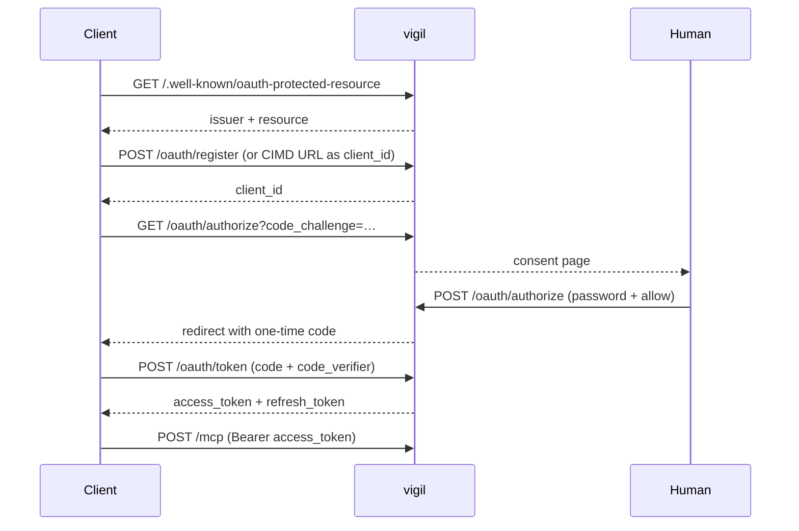

# OAuth 2.1

vigil is its own authorization server. There is no static bearer token: every
client authenticates through a standard OAuth 2.1 Authorization Code flow with
PKCE, registering either via Dynamic Client Registration or via a Client-ID
Metadata Document.

This document describes the implemented surface. The code in
[`lib/vigil/oauth/`](../lib/vigil/oauth/) and
[`lib/vigil/mcp/server.ex`](../lib/vigil/mcp/server.ex) is the authority.

---

## Architectural decisions

**Authorization server and resource server are the same process.** Issuer comes
from `VIGIL_ISSUER`, resource from `VIGIL_RESOURCE`.

**Access tokens are opaque, not JWTs.** A 32-byte random value, hex encoded.
Since issuer and verifier are the same process, a JWT buys nothing — only a
signature library as a dependency and a class of bug (wrong `aud` claims) that
cannot exist with a lookup. The audience is stored at issue time and compared
at verification time.

**Persistence via `:dets`.** Tokens and registered clients must survive a
restart, otherwise every deploy forces re-authorization. `:dets` ships with
OTP; no dependency.

**Both registration paths are supported.** DCR for claude.ai, CIMD for Claude
Code.

---

## Walked against RFC 9700

vigil is a hand-written OAuth 2.1 authorization server, so at some point
somebody has to walk it against
[RFC 9700](https://www.rfc-editor.org/rfc/rfc9700.html), *Best Current Practice
for OAuth 2.0 Security*. This section is the result, so the next reviewer does
not re-derive it. Each answer is the behaviour of the code, not an intention.

**Is `code_challenge` required, and is `plain` refused?** Yes and yes.
`Vigil.OAuth.Flow.authorize_details/1` rejects a missing or empty
`code_challenge` with `invalid_request`, and requires
`code_challenge_method` to be exactly `S256` — so `plain` is refused, and so is
an *absent* method, which RFC 7636 would otherwise default to `plain`. The
verifier is checked at the token endpoint with
`Plug.Crypto.secure_compare/2`. This is stricter than §2.1.1 asks: "Authorization
servers MUST support PKCE", and "MUST mitigate PKCE downgrade attacks by
ensuring that a token request containing a `code_verifier` parameter is accepted
only if a `code_challenge` parameter was present in the authorization request"
— here there is no request without one. (§2.1.1, §4.8)

**Can a code be redeemed by another client, and is `redirect_uri` re-checked
at the token endpoint?** No, and yes. `grant/2` compares both the stored
`client_id` and the stored `redirect_uri` against the token request and answers
`invalid_grant` on either mismatch. The code is deleted on lookup — `take_code/1`
— so it is one-time even on the failing paths. What that binding does *not* do
is authenticate: every client here is public (see below), so `client_id` is
asserted rather than proven, and PKCE is the actual defence against code
injection. (§4.5.3.1)

**What binds the authorization response to the request that started it, and
what if `state` is absent?** `state` is echoed when the client sends one and
omitted when it does not; vigil never invents one. The binding to the browser
session is the client's to hold, and §4.7.1 says PKCE is enough for it: "PKCE
provides robust protection against CSRF attacks even in the presence of an
attacker that can read the authorization response", and "the same protection is
provided by PKCE or the OpenID Connect nonce value". Since PKCE is mandatory
here, a client that omits `state` is not thereby unprotected. (§4.7.1)

**Are refresh tokens rotated, and what happens on a second presentation?**
Rotated, and the second presentation revokes the whole authorization grant.
That meets §2.2.2 — "Refresh tokens for public clients MUST be
sender-constrained or use refresh token rotation" — and acts on the detection
§4.14.2 asks for, rather than only generating it.

The mechanism is a marker, not a deletion. The presented token is marked
**spent** before the new pair is minted; presenting a spent token is the
signal, because §4.14.2's case is precisely that "if a refresh token is
compromised and subsequently used by both the attacker and the legitimate
client, one of them will present an invalidated refresh token". vigil cannot
tell which of the two did, so every access and refresh token descended from
that authorization goes — which is the cost §4.14.2 names, "forcing the
legitimate client to obtain a fresh authorization grant".

Three things about the shape:

- **The family is keyed on the grant, not the client.** A `grant_id` is minted
  with the authorization code and carried onto every token redeemed or
  refreshed from it. A client legitimately holds more than one grant over
  time, so revoking by `client_id` would take down authorizations that had
  nothing to do with the replay.
- **The answer is `invalid_grant` either way**, identical to a refresh token
  that never existed. The caller does not learn that a family was found.
- **No other check runs first.** Presenting a spent token *is* the signal, so
  an attacker who has the token but not the `client_id` cannot keep the family
  alive by getting the rest of the request wrong.

A spent marker is evidence with an expiry date: the record keeps its
`expires_at` and the janitor reclaims it on the same schedule as a live token,
so the table does not grow a permanent tombstone per rotation. Tokens written
before grants existed carry none, and "every token whose grant is unknown" is
deliberately not treated as a family — one replay must not revoke a stranger.
`mix vigil.seed_token` mints a grant of its own for the token it writes, so a
token seeded out of band is a one-token family rather than a token with no
family. (§2.2.2, §4.14.2)

**Does the authorization response carry `iss`?** Yes, on the success redirect
and the error redirect alike — RFC 9207 §2 asks for both: "In authorization
responses to the client, including error responses, an authorization server
supporting this specification MUST indicate its identity by including the `iss`
parameter in the authorization response." Every response leaves through one
function, `redirect_with_query/3`, so there is no shape that can forget it, and
`authorization_response_iss_parameter_supported` in the metadata is what tells
a client it may reject a response that arrives without one.

This is the mix-up defence. Without it a client that talks to more than one
authorization server cannot tell which one answered, and can be induced to send
a code minted by an attacker's server to vigil, or vigil's code to the
attacker's token endpoint. §4.4.2.2 names the alternative — a distinct redirect
URI per authorization server — but that is the client's choice to make, not
something vigil can enforce. (§4.4.2.1)

**What authenticates a client at the token endpoint?** Nothing —
`token_endpoint_auth_methods_supported` is `["none"]` and there are no client
secrets, by design for a single-user deployment. The consequence for the
loopback clients the consent page warns about is bounded by PKCE: a local
process that races the redirect and grabs the code still cannot redeem it
without the `code_verifier`, which never leaves the real client. The warning on
the consent page is about a different thing — that any local process can *ask*
for consent while looking like the client. (§2.5, and RFC 8252 §8.3)

**Is the rate limit per client, per address, or global — and what does an
attacker gain by exhausting it for someone else?** There are three limits and
they cover different things:

| Limit | Keyed on | Budget | Covers |
|---|---|---|---|
| `Vigil.RateLimit` at `/mcp` | access token | `VIGIL_RATE_LIMIT_RPM`/min | every `/mcp` request, and only once the token has validated |
| `Vigil.RateLimit` at the OAuth endpoints | client address | `VIGIL_OAUTH_RATE_LIMIT_RPM`/min, `VIGIL_OAUTH_REGISTER_RATE_LIMIT_RPM`/min | `/oauth/register`, `/oauth/authorize`, `/oauth/token` |
| `Vigil.OAuth.Store.rate_limited?/2` | client address | 5 per 15 min | wrong passwords on the consent form, and nothing else |

The middle row is the one that bounds an unauthenticated caller, and it is
checked *before* the handler runs rather than inside it, so a refusal costs
nothing the request was trying to buy: `/authorize` refuses before
`Vigil.OAuth.Client.resolve/2` can send a CIMD fetch to an address the caller
chose, `/register` before it writes a `:dets` row and fsyncs it, `/token`
before it looks a guess up. Refusals take the shape of the surface they
refuse — an HTML page for the consent form, an RFC 6749 `temporarily_unavailable`
body for the two endpoints a program reads.

What an attacker gains by exhausting someone else's budget is bounded by the
key: with the proxy settings configured it is one address's budget, and
without them it is the single global bucket described in the next answer. The
consent limit is the one worth spending, and it locks out consenting for
fifteen minutes rather than anything longer-lived.

**Which address is a limit keyed on, behind a proxy?** Whatever
`Vigil.OAuth.ClientAddr` says, which is `conn.remote_ip` until the deployment
says otherwise. A forwarded header is written by whoever sent the request
unless something in front of vigil overwrites it, so believing one
unconditionally would turn a per-address limit into no limit at all. §4.13
states the condition first: "A reverse proxy MUST therefore sanitize any
inbound requests to ensure the authenticity and integrity of all header values
relevant for the security of the application servers". vigil therefore reads a
header only when told its name *and* told which peers may set it
(`VIGIL_TRUSTED_PROXY_HEADER`, `VIGIL_TRUSTED_PROXIES`), takes the rightmost
hop it did not add itself, and falls back to the peer on anything it cannot
account for — an untrusted peer, an unparseable hop, a list that is entirely
its own proxies. Both settings are empty by default, so a deployment that has
not been told about its proxy keeps the single global bucket it always had
rather than silently getting worse. (§4.13)

Two things the walk confirmed in passing: the authorization server never
redirects to an unregistered `redirect_uri` — an untrusted client or URI gets a
400 HTML page and no `Location` at all (§4.11.2) — and the consent page refuses
framing since the headers below (§4.16).

### What the walk found

| # | Gap | RFC 9700 | Answered by |
|---|---|---|---|
| [#77](https://github.com/64x-lunicorn/vigil/issues/77) | No `iss` in the authorization response | §4.4.2.1 | `iss` on both redirect shapes, advertised |
| [#78](https://github.com/64x-lunicorn/vigil/issues/78) | Refresh replay is detected but nothing is revoked | §4.14.2 | a replay revokes the whole grant |
| [#79](https://github.com/64x-lunicorn/vigil/issues/79) | The OAuth endpoints have no rate limit | — | `Vigil.RateLimit`, per address per endpoint |
| [#81](https://github.com/64x-lunicorn/vigil/issues/81) | The consent limit counts the proxy, not the client | §4.13 | `Vigil.OAuth.ClientAddr` |

None of them was an incident on the current deployment, where Cloudflare Access
is in front of the endpoint. They are the defences that were absent behind it.

---

## Endpoints

All served by `Vigil.OAuth.Endpoint`, which `Vigil.MCP.Server` forwards to for
everything that is not `/mcp`. The decisions behind them — registration, the
checks on an `/authorize` request, both grants — live in `Vigil.OAuth.Flow`
and take no `Plug.Conn`.

| Path | Method | Purpose |
|---|---|---|
| `/.well-known/oauth-protected-resource` | GET | RFC 9728 resource metadata |
| `/.well-known/oauth-protected-resource/mcp` | GET | same body, path variant clients also try |
| `/.well-known/oauth-authorization-server` | GET | RFC 8414 AS metadata |
| `/oauth/register` | POST | RFC 7591 Dynamic Client Registration |
| `/oauth/authorize` | GET | consent page (HTML) |
| `/oauth/authorize` | POST | process consent, issue code, redirect |
| `/oauth/token` | POST | code → access token, refresh → access token |
| `/mcp` | POST | the MCP endpoint itself |

No revocation endpoint and no introspection endpoint — neither is needed for a
single-user deployment.

---

## Discovery

`GET /.well-known/oauth-protected-resource` — must be reachable without a
token:

```json
{
  "resource": "https://vault.example.org/mcp",
  "authorization_servers": ["https://vault.example.org"],
  "scopes_supported": ["vault", "vault:read"],
  "bearer_methods_supported": ["header"]
}
```

`GET /.well-known/oauth-authorization-server`:

```json
{
  "issuer": "https://vault.example.org",
  "authorization_endpoint": "https://vault.example.org/oauth/authorize",
  "token_endpoint": "https://vault.example.org/oauth/token",
  "registration_endpoint": "https://vault.example.org/oauth/register",
  "scopes_supported": ["vault", "vault:read"],
  "response_types_supported": ["code"],
  "grant_types_supported": ["authorization_code", "refresh_token"],
  "code_challenge_methods_supported": ["S256"],
  "token_endpoint_auth_methods_supported": ["none"],
  "client_id_metadata_document_supported": true,
  "authorization_response_iss_parameter_supported": true
}
```

Two fields matter more than they look:

- **`code_challenge_methods_supported` is mandatory.** Without it, clients
  refuse to connect per spec.
- **`token_endpoint_auth_methods_supported: ["none"]`** — every client here is
  a public client using PKCE rather than a client secret. This value is also a
  precondition for a client choosing CIMD.

---

## The 401 challenge

Every unauthorized request to `/mcp`:

```http
HTTP/1.1 401 Unauthorized
WWW-Authenticate: Bearer resource_metadata="https://vault.example.org/.well-known/oauth-protected-resource", scope="vault"
```

Empty body. **Without this header the client cannot find the authorization
server** and reports only that it could not reach the MCP server.

---

## Client registration

### Dynamic Client Registration

`POST /oauth/register`, no auth. Responds `201` with a `client_id` and **no
`client_secret`** — public client.

Redirect URIs are validated at registration: each must be `https://`, or
`http://` with host `localhost` or `127.0.0.1`. Anything else is rejected with
`invalid_redirect_uri`.

### Client-ID Metadata Document

If `client_id` is an `https://` URL, the document is fetched and validated:

1. Fetch over HTTPS, 5 s timeout, 64 KB maximum. The cap is applied **during**
   the read — a declared `Content-Length` over it ends the request before any
   body is read, and an undeclared body is counted as it arrives and cancelled
   on the chunk that crosses the cap — so an oversized response is never
   buffered in full.
2. `client_id` inside the document must equal the URL exactly.
3. Required fields present: `client_id`, `client_name`, `redirect_uris`.
4. Result cached for one hour.

**SSRF protection.** HTTPS only, and redirects are not followed, so a 302 into
the private range cannot be followed either.

The host is resolved **once**. That address is checked, and the socket is then
opened against *that address* rather than against the URL. This is what closes
DNS rebinding: a guard that resolves, approves, and then hands the URL to an
HTTP client which resolves again is bypassed by an attacker who controls the
host's DNS and answers the two lookups differently — a public address for the
guard, `127.0.0.1` for the connection. With one lookup there is no second
answer to give.

Pinning the address costs nothing in certificate verification. The host travels
as the `Host` header and as `server_name_indication`, which in OTP's `:ssl` is
both the SNI extension and the reference identity the hostname check runs
against — so TLS is still verified against the system trust store, for the name
in the `client_id`, not for the address.

The address must not fall into any of:

| Family | Refused |
|---|---|
| IPv4 | `0.0.0.0/8`, `10.0.0.0/8`, `100.64.0.0/10` (CGNAT), `127.0.0.0/8`, `169.254.0.0/16`, `172.16.0.0/12`, `192.168.0.0/16`, `198.18.0.0/15` (benchmarking) |
| IPv6 | `::`, `::1`, `fc00::/7` (unique local), `fe80::/10` (link-local) |
| IPv4-mapped IPv6 | `::ffff:a.b.c.d` is unfolded to `a.b.c.d` first, so every IPv4 row above covers its mapped form |

---

## Redirect URI matching

This is the part where OAuth integrations usually fail.

- **HTTPS URIs:** exact string comparison.
- **Loopback URIs:** clients use an ephemeral port, e.g.
  `http://localhost:3118/callback`, while only `http://localhost/callback` is
  registered. Scheme, host and path must match exactly; **the port is
  ignored**. This applies to `localhost` and `127.0.0.1` alike.

No prefix matching, no wildcards, no ignoring the path. On mismatch: `400`
with an HTML error page and **no redirect** — open-redirect protection.

---

## The authorization flow



The consent page requires the `VIGIL_AUTH_PASSWORD` every time. There is no
session cookie after login — it happens rarely enough.

Every redirect back to the client carries `iss`, the issuer identifier of
RFC 9207, next to `code` (or `error`) and the `state` the client sent. See the
mix-up answer in the RFC 9700 walk above.

A loopback redirect address is called out on the consent page: any local
process on that machine could impersonate the client.

### Response headers on the consent page

It is the only HTML vigil serves and the only place a human types a password.
It also has almost nothing to allow — no template directory, no assets, no
JavaScript, and one inline `<style>` block — so the policy denies everything
and carves out exactly that block, by nonce rather than by `'unsafe-inline'`.

```http
Content-Security-Policy: default-src 'none'; base-uri 'none'; frame-ancestors 'none'; style-src 'nonce-<per-response>'
X-Frame-Options: DENY
X-Content-Type-Options: nosniff
Referrer-Policy: no-referrer
```

| Header | What it buys |
|---|---|
| `frame-ancestors 'none'` + `X-Frame-Options: DENY` | The page cannot be framed, so an attacker cannot steer a click onto **Allow**. The second is for clients that predate the first. |
| `Referrer-Policy: no-referrer` | The consent page's URL carries `client_id`, `redirect_uri`, `state` and `code_challenge`. It stops leaking. |
| `base-uri 'none'` | An injected `<base>` cannot re-point the one relative URL on the page, the form's own action. |
| `default-src 'none'` + `nosniff` | Closes the distance between "renders no external assets today" and "renders no external assets". |

**`form-action 'self'` is deliberately absent.** The password POST does land on
this origin, but its answer is a 302 to the client's `redirect_uri`, which is
another origin by definition. Whether `form-action` applies to a redirect
*after* a submission is
[debated](https://github.com/w3c/webappsec-csp/issues/8), and MDN warns that
"browser implementations of this aspect are inconsistent (e.g., Firefox 57
doesn't block the redirects whereas Chrome 63 does)". So the directive can break
the Allow button in the more likely of the two browsers, and it guards nothing
here: the form's action is a literal in the template with nowhere for input to
reach it. A `Plug.Test` assertion could not catch the breakage either, since it
only ever observes the 302.

`Vigil.OAuth.ConsentPage` both mints the nonce and stamps it on its `<style>`
tag, so one module owns what the value is; `Vigil.OAuth.Endpoint` only names it
in the header. The HTML error page gets the same headers minus `style-src`,
having no style at all.

The escaping on the page is separate and unchanged: `client_name`, the redirect
host, the error text and every hidden field value are HTML-escaped, because
`client_name` is whatever a client registered.

---

## Token endpoint

`Content-Type: application/x-www-form-urlencoded`, no client auth, responses
always `Cache-Control: no-store`.

### `grant_type=authorization_code`

Checks run in this order:

1. Code exists → else `invalid_grant`
2. **Delete the code immediately** — one-time use, including on the failures below
3. Not expired → else `invalid_grant`
4. `client_id` matches the stored one → else `invalid_grant`
5. `redirect_uri` matches the stored one → else `invalid_grant`
6. PKCE: `base64url(sha256(code_verifier))` equals the stored `code_challenge`
   → else `invalid_grant`
7. If `resource` was sent, it must match the stored one → else `invalid_target`

Success returns an access token (1 hour) and a refresh token (30 days), both
carrying the `grant_id` minted with the code.

### `grant_type=refresh_token`

**Rotation is mandatory** for a public client: the old refresh token is marked
spent and a new pair is issued.

Checks run in this order:

1. Token exists and is a refresh token → else `invalid_grant`
2. **Already spent → revoke every token of that grant**, and answer
   `invalid_grant`. This check is first on purpose; see the replay answer in
   the RFC 9700 walk above
3. Not expired → else `invalid_grant`
4. `client_id` matches the stored one → else `invalid_grant`
5. If `resource` was sent, it must match the stored one → else `invalid_target`

An invalid, expired or replayed refresh token **must** return `invalid_grant` —
specifically not `invalid_request` and not a custom code. Clients renew tokens
reactively on a 401 and proactively shortly before expiry; a wrong error code
breaks renewal. A client whose grant was revoked has to run the authorization
flow again, consent page included.

### Error format

RFC 6749: `{"error": "...", "error_description": "..."}` with HTTP 400, except
`invalid_client` which returns 401. Permitted values: `invalid_request`,
`invalid_client`, `invalid_grant`, `unsupported_grant_type`, `invalid_target`.

**A rate-limited request is the one deliberate departure**: HTTP 429,
`{"error": "temporarily_unavailable"}`, and a `Retry-After` carrying the
window. §5.2 lists neither — it mandates 400 for the token endpoint, and
`temporarily_unavailable` is §4.1.2.1's code, defined for the authorization
endpoint. Both are kept anyway. §8.5 allows further error codes; 429 postdates
RFC 6749 entirely (it is RFC 6585's) and is the only status that says "refused
for rate" rather than "your request was malformed"; and a client that renews
reactively on a 401 has to tell those two apart or it will retry a malformed
request forever. `Retry-After` comes from the window itself, so the wait is a
fact rather than a guess.

---

## Token verification at `/mcp`

On every request: look the token up, reject refresh tokens presented as access
tokens, check expiry (deleting the token if expired), and compare the stored
audience against the configured resource with a constant-time comparison.

Scope decides what the token may call: `vault` allows everything, `vault:read`
rejects every write tool with an explicit error rather than an HTTP-level 403.

---

## Storage and cleanup

Three `:dets` files under `VIGIL_STATE_DIR`, mode `0600`, owned by `vigil`:
`oauth_clients.dets`, `oauth_codes.dets`, `oauth_tokens.dets`.
`:dets.sync/1` after every write — the write rate is low enough that it does
not matter, and a token lost to a crash costs one re-authorization.

`Vigil.OAuth.Janitor` runs every five minutes and sweeps all four tables:
expired authorization codes, expired access and refresh tokens — spent ones
included, since a rotated refresh token is marked rather than deleted —
rate-limit counters older than 15 minutes, and CIMD cache entries whose hour
is up. No cron, no job library — just `Process.send_after/3`.

The CIMD cache matters most of the four. It is keyed on the `client_id` URL a
client supplies and filled from `GET /oauth/authorize`, so it grows on input
from outside. Two separate things bound it: the per-address limit on
`/oauth/authorize` bounds the rate at which a caller can add to it, and this
sweep bounds the total by dropping what has expired. Neither substitutes for
the other — a rate limit alone leaves a table that only grows, and a sweep
alone leaves the rate unbounded.

The interval and the instant are both arguments with production defaults, so a
test can drive one sweep rather than wait five minutes for it. The instant is a
function, not a value: the janitor outlives any single one.

> **Note:** `:dets` is not safe for concurrent access from multiple OS
> processes. Seeding a token while the service is running must go through
> `bin/vigil rpc` in the running node, not a second `mix` process. See
> `vigil_seed_token` in [`scripts/lib.sh`](../scripts/lib.sh).

---

## Configuration

```
VIGIL_ISSUER=https://vault.example.org
VIGIL_RESOURCE=https://vault.example.org/mcp
VIGIL_AUTH_PASSWORD=<secret, min. 12 characters>
VIGIL_STATE_DIR=/var/lib/vigil
```

**Startup check:** if `VIGIL_AUTH_PASSWORD` is missing or shorter than 12
characters the application refuses to start. A publicly reachable authorization
server without a strong password is an open door to the vault.

A broken OAuth store deliberately takes the whole service down: a service that
cannot authenticate anyone is worse than no service.

---

## Non-goals

- No multi-user, no registration, no password recovery
- No scopes beyond `vault` and `vault:read`, no step-up flow
- No JWT, no signing keys, no JWKS
- No `client_credentials` grant
- No `client_secret` — every client is public and uses PKCE
- No revocation *endpoint* — a replayed refresh token revokes its grant from
  the inside, but there is nothing for a client to call (delete the `.dets`
  file)
- No OpenID Connect discovery
- No session cookie after login
