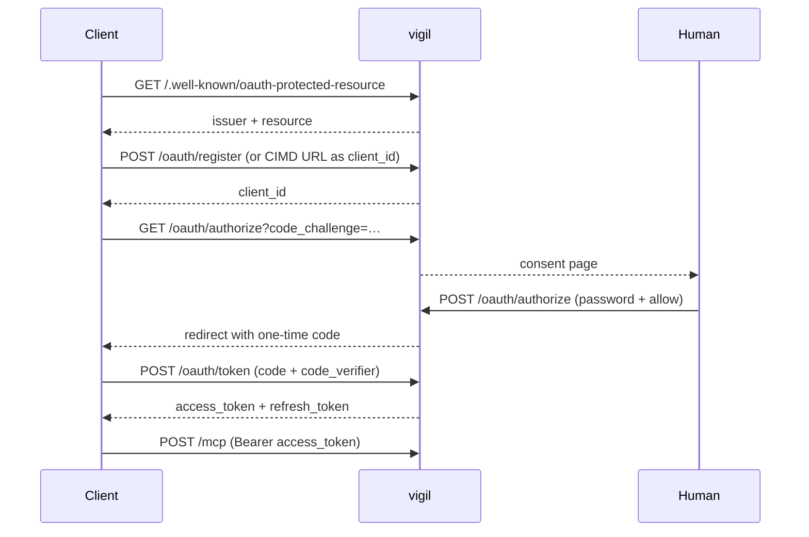

# OAuth 2.1

vigil is its own authorization server. There is no static bearer token: every
client authenticates through a standard OAuth 2.1 Authorization Code flow with
PKCE, registering either via Dynamic Client Registration or via a Client-ID
Metadata Document.

This document describes the implemented surface. The code in
[`lib/vigil/oauth/`](../lib/vigil/oauth/) and
[`lib/vigil/mcp/server.ex`](../lib/vigil/mcp/server.ex) is the authority.

---

## Architectural decisions

**Authorization server and resource server are the same process.** Issuer comes
from `VIGIL_ISSUER`, resource from `VIGIL_RESOURCE`.

**Access tokens are opaque, not JWTs.** A 32-byte random value, hex encoded.
Since issuer and verifier are the same process, a JWT buys nothing — only a
signature library as a dependency and a class of bug (wrong `aud` claims) that
cannot exist with a lookup. The audience is stored at issue time and compared
at verification time.

**Persistence via `:dets`.** Tokens and registered clients must survive a
restart, otherwise every deploy forces re-authorization. `:dets` ships with
OTP; no dependency.

**Both registration paths are supported.** DCR for claude.ai, CIMD for Claude
Code.

---

## Endpoints

All on the same router as `/mcp`.

| Path | Method | Purpose |
|---|---|---|
| `/.well-known/oauth-protected-resource` | GET | RFC 9728 resource metadata |
| `/.well-known/oauth-protected-resource/mcp` | GET | same body, path variant clients also try |
| `/.well-known/oauth-authorization-server` | GET | RFC 8414 AS metadata |
| `/oauth/register` | POST | RFC 7591 Dynamic Client Registration |
| `/oauth/authorize` | GET | consent page (HTML) |
| `/oauth/authorize` | POST | process consent, issue code, redirect |
| `/oauth/token` | POST | code → access token, refresh → access token |
| `/mcp` | POST | the MCP endpoint itself |

No revocation endpoint and no introspection endpoint — neither is needed for a
single-user deployment.

---

## Discovery

`GET /.well-known/oauth-protected-resource` — must be reachable without a
token:

```json
{
  "resource": "https://vault.example.org/mcp",
  "authorization_servers": ["https://vault.example.org"],
  "scopes_supported": ["vault", "vault:read"],
  "bearer_methods_supported": ["header"]
}
```

`GET /.well-known/oauth-authorization-server`:

```json
{
  "issuer": "https://vault.example.org",
  "authorization_endpoint": "https://vault.example.org/oauth/authorize",
  "token_endpoint": "https://vault.example.org/oauth/token",
  "registration_endpoint": "https://vault.example.org/oauth/register",
  "scopes_supported": ["vault", "vault:read"],
  "response_types_supported": ["code"],
  "grant_types_supported": ["authorization_code", "refresh_token"],
  "code_challenge_methods_supported": ["S256"],
  "token_endpoint_auth_methods_supported": ["none"],
  "client_id_metadata_document_supported": true
}
```

Two fields matter more than they look:

- **`code_challenge_methods_supported` is mandatory.** Without it, clients
  refuse to connect per spec.
- **`token_endpoint_auth_methods_supported: ["none"]`** — every client here is
  a public client using PKCE rather than a client secret. This value is also a
  precondition for a client choosing CIMD.

---

## The 401 challenge

Every unauthorized request to `/mcp`:

```http
HTTP/1.1 401 Unauthorized
WWW-Authenticate: Bearer resource_metadata="https://vault.example.org/.well-known/oauth-protected-resource", scope="vault"
```

Empty body. **Without this header the client cannot find the authorization
server** and reports only that it could not reach the MCP server.

---

## Client registration

### Dynamic Client Registration

`POST /oauth/register`, no auth. Responds `201` with a `client_id` and **no
`client_secret`** — public client.

Redirect URIs are validated at registration: each must be `https://`, or
`http://` with host `localhost` or `127.0.0.1`. Anything else is rejected with
`invalid_redirect_uri`.

### Client-ID Metadata Document

If `client_id` is an `https://` URL, the document is fetched and validated:

1. Fetch over HTTPS, 5 s timeout, 64 KB maximum.
2. `client_id` inside the document must equal the URL exactly.
3. Required fields present: `client_id`, `client_name`, `redirect_uris`.
4. Result cached for one hour.

**SSRF protection:** HTTPS only, redirects are not followed, and the resolved
IP must not fall into `127.0.0.0/8`, `10.0.0.0/8`, `172.16.0.0/12`,
`192.168.0.0/16`, `169.254.0.0/16`, `::1` or `fc00::/7`.

---

## Redirect URI matching

This is the part where OAuth integrations usually fail.

- **HTTPS URIs:** exact string comparison.
- **Loopback URIs:** clients use an ephemeral port, e.g.
  `http://localhost:3118/callback`, while only `http://localhost/callback` is
  registered. Scheme, host and path must match exactly; **the port is
  ignored**. This applies to `localhost` and `127.0.0.1` alike.

No prefix matching, no wildcards, no ignoring the path. On mismatch: `400`
with an HTML error page and **no redirect** — open-redirect protection.

---

## The authorization flow



The consent page requires the `VIGIL_AUTH_PASSWORD` every time. There is no
session cookie after login — it happens rarely enough.

A loopback redirect address is called out on the consent page: any local
process on that machine could impersonate the client.

---

## Token endpoint

`Content-Type: application/x-www-form-urlencoded`, no client auth, responses
always `Cache-Control: no-store`.

### `grant_type=authorization_code`

Checks run in this order:

1. Code exists → else `invalid_grant`
2. **Delete the code immediately** — one-time use, including on the failures below
3. Not expired → else `invalid_grant`
4. `client_id` matches the stored one → else `invalid_grant`
5. `redirect_uri` matches the stored one → else `invalid_grant`
6. PKCE: `base64url(sha256(code_verifier))` equals the stored `code_challenge`
   → else `invalid_grant`
7. If `resource` was sent, it must match the stored one → else `invalid_target`

Success returns an access token (1 hour) and a refresh token (30 days).

### `grant_type=refresh_token`

**Rotation is mandatory** for a public client: the old refresh token is deleted
and a new one issued alongside the new access token.

An invalid or expired refresh token **must** return `invalid_grant` —
specifically not `invalid_request` and not a custom code. Clients renew tokens
reactively on a 401 and proactively shortly before expiry; a wrong error code
breaks renewal.

### Error format

RFC 6749: `{"error": "...", "error_description": "..."}` with HTTP 400, except
`invalid_client` which returns 401. Permitted values: `invalid_request`,
`invalid_client`, `invalid_grant`, `unsupported_grant_type`, `invalid_target`.

---

## Token verification at `/mcp`

On every request: look the token up, reject refresh tokens presented as access
tokens, check expiry (deleting the token if expired), and compare the stored
audience against the configured resource with a constant-time comparison.

Scope decides what the token may call: `vault` allows everything, `vault:read`
rejects every write tool with an explicit error rather than an HTTP-level 403.

---

## Storage and cleanup

Three `:dets` files under `VIGIL_STATE_DIR`, mode `0600`, owned by `vigil`:
`oauth_clients.dets`, `oauth_codes.dets`, `oauth_tokens.dets`.
`:dets.sync/1` after every write — the write rate is low enough that it does
not matter, and a token lost to a crash costs one re-authorization.

`Vigil.OAuth.Janitor` runs every five minutes and deletes expired codes,
expired access and refresh tokens, and rate-limit counters older than 15
minutes. No cron, no job library — just `Process.send_after/3`.

> **Note:** `:dets` is not safe for concurrent access from multiple OS
> processes. Seeding a token while the service is running must go through
> `bin/vigil rpc` in the running node, not a second `mix` process. See
> `vigil_seed_token` in [`scripts/lib.sh`](../scripts/lib.sh).

---

## Configuration

```
VIGIL_ISSUER=https://vault.example.org
VIGIL_RESOURCE=https://vault.example.org/mcp
VIGIL_AUTH_PASSWORD=<secret, min. 12 characters>
VIGIL_STATE_DIR=/var/lib/vigil
```

**Startup check:** if `VIGIL_AUTH_PASSWORD` is missing or shorter than 12
characters the application refuses to start. A publicly reachable authorization
server without a strong password is an open door to the vault.

A broken OAuth store deliberately takes the whole service down: a service that
cannot authenticate anyone is worse than no service.

---

## Non-goals

- No multi-user, no registration, no password recovery
- No scopes beyond `vault` and `vault:read`, no step-up flow
- No JWT, no signing keys, no JWKS
- No `client_credentials` grant
- No `client_secret` — every client is public and uses PKCE
- No revocation endpoint (delete the `.dets` file)
- No OpenID Connect discovery
- No session cookie after login
